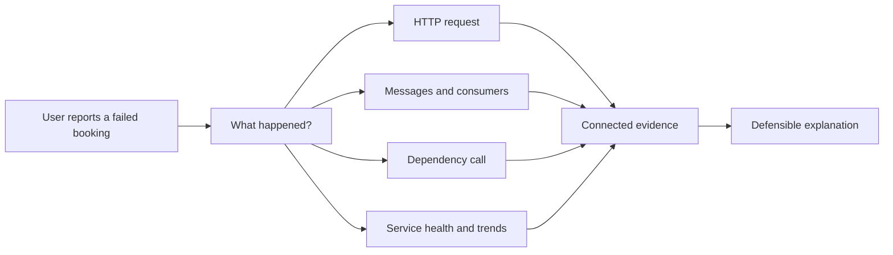
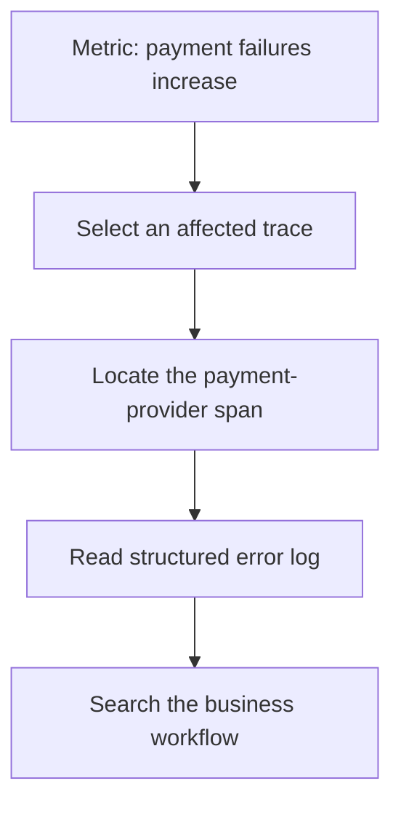
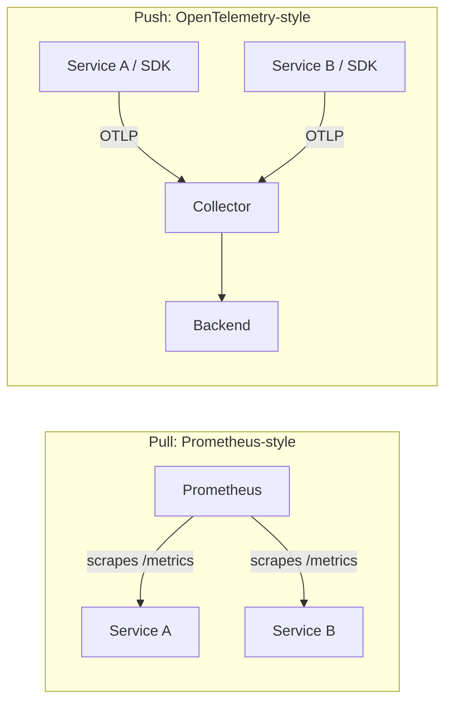
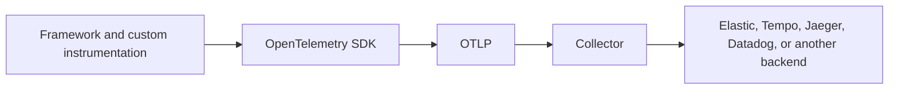
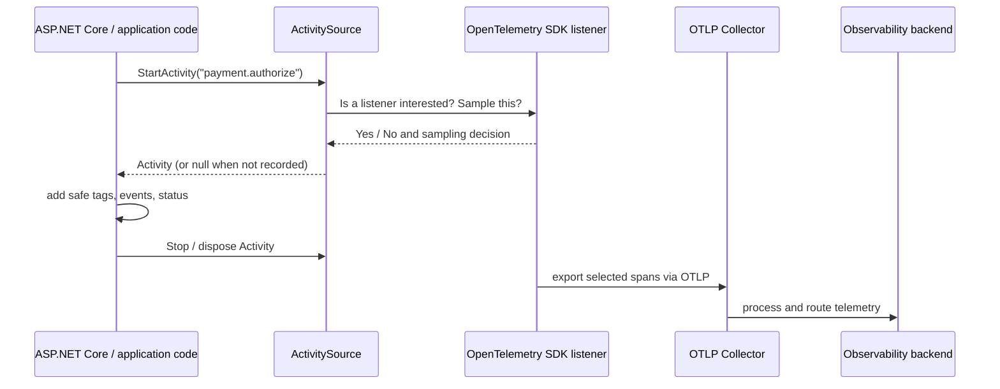

# Observability: understanding a distributed system

<p align="right"><a href="README.fa.md"><strong>فارسی</strong></a></p>

This guide uses the booking system in this repository as a concrete example,
but the ideas apply to .NET, Java/Spring, Python/Django, frontend services, and
other distributed applications.

For implementation details, project layout, and local execution, see the
[technical guide](README.technical.md).

## Why observability matters

In a simple application, a failed request often stays in one process and one
log stream. In a distributed application, the same action can become a chain
of independent work: an HTTP request publishes a message, a worker consumes
it later, another service calls a dependency, and a final side effect happens
asynchronously. The user sees one outcome; engineers must understand many
pieces of evidence.



Observability does not mean that every engineer must inspect every signal for
every incident. It means the system preserves enough context that an engineer
can ask a new question after a failure and follow evidence toward an answer,
rather than reconstructing the story from timestamps and guesswork.

## Logs, metrics, and traces

These signals overlap, but they serve different resolutions of investigation.

| Signal | What it records | Best starting question | Example in this system |
| --- | --- | --- | --- |
| Log | A detailed event, decision, or exception | “What did the payment code decide?” | Provider rejection reason |
| Metric | An aggregate measurement over many events | “Are payment failures rising?” | Failure count or duration histogram |
| Trace | A timed graph for one operation | “Which service or dependency was slow?” | HTTP → RabbitMQ → Payment path |

A metric is efficient for detecting a broad change; it deliberately loses
per-request detail. A trace restores the execution path and timing for one
operation. A log adds rich local context such as an exception, provider
response, or business reason. Treating one signal as a replacement for the
others creates blind spots.

### How the signals work together

Imagine that payment failures rise after a provider change. A metric can show
that the rate changed and whether the impact is broad. It cannot show the
precise code path for one booking. A trace can reveal that the payment provider
span is slow or failing, but it may not contain the provider's explanatory
message. A structured log can contain that message and the identifiers needed
to search it. The investigation is stronger because the signals lead into one
another.



### Pull metrics vs push metrics

Prometheus popularized the **pull** model: a Prometheus server discovers
targets and periodically scrapes each service's `/metrics` endpoint. This is a
strong model for infrastructure inside one well-connected environment: the
collector controls scrape frequency, can see whether a target is down, and
service discovery is a first-class part of the design.

OpenTelemetry commonly uses **push** for application metrics: the SDK batches
measurements and exports them with OTLP to a Collector, which then routes them
to the chosen backend.



For this repository, **push is the preferred application-telemetry model**:

- the same OTLP route carries metrics, traces, and logs, so application teams
  configure one telemetry egress path;
- services do not need a publicly reachable scrape endpoint or scraper-specific
  discovery configuration;
- the Collector centralizes batching, retries, authentication, filtering, and
  backend routing—especially useful with containers, short-lived workers, and
  multiple environments;
- the application remains backend-neutral: changing the Collector's exporter
  does not change metric-producing code.

That is a preference for this event-driven application, not a rejection of
Prometheus. Pull remains excellent for Kubernetes/node/infrastructure metrics
and teams already invested in Prometheus discovery and PromQL. A hybrid is
common: scrape infrastructure with Prometheus and push application telemetry
through OTLP. Prometheus describes its architecture as pull-oriented, while
the OTel OTLP metrics exporter is explicitly a push exporter. [Prometheus and
OTLP](https://opentelemetry.io/docs/compatibility/prometheus/otlp-metrics-export/),
[OTLP metrics exporter](https://opentelemetry.io/docs/specs/otel/metrics/sdk_exporters/otlp/)

## Structured logs and Serilog

A log record should be more than a rendered sentence. It can contain a time,
level, category, exception, message template, named properties, and contextual
attributes such as service name or correlation ID.

```csharp
// The identifier is only text; a backend must parse the sentence.
logger.LogInformation($"Payment {paymentId} failed");

// The identifiers are first-class searchable properties.
logger.LogWarning(
    "Payment {PaymentId} failed for booking {BookingId}: {Reason}",
    paymentId, bookingId, reason);
```

In .NET, `ILogger<T>` is an abstraction. `ILoggerFactory` sends records to
registered providers; ASP.NET Core configures this pipeline through
`WebApplication.CreateBuilder` and dependency injection. This repository uses
Serilog as a provider for structured events, contextual enrichment, console
output, OTLP log export, and one request-completion record per HTTP request.
Business code still depends on `ILogger<T>`, not Serilog-specific APIs.

Structured logging is especially important in a distributed system because a
human-readable sentence is not a stable data model. Field names such as
`BookingId`, `PaymentId`, `Reason`, `ServiceName`, and `CorrelationId` become
the handles that let users filter, aggregate, alert, and join related evidence.
Choose names that describe the domain, keep values safe for retention, and
avoid high-cardinality or sensitive data unless there is a deliberate policy.

## OpenTelemetry

OpenTelemetry is a vendor-neutral open-source standard and ecosystem. It
defines APIs, SDKs, instrumentation libraries, semantic conventions,
Collectors, and OTLP—the protocol that carries telemetry. It is not itself a
database, dashboard, or alerting product.



This boundary protects application instrumentation from backend churn. Moving
backends may still require dashboard, query, retention, and alert migrations,
but it does not require replacing every manual span in application code. In
.NET, OpenTelemetry builds on `System.Diagnostics.Activity`, `ActivitySource`,
and `Meter`; an `Activity` is conceptually a span.

OpenTelemetry also gives teams a common language. A service can attach
attributes according to semantic conventions, propagate W3C trace context over
HTTP and messaging, and send signals through OTLP. That makes it much easier
for services written in different languages to participate in one
investigation.

### How the .NET OpenTelemetry SDK works

OpenTelemetry in .NET is built on runtime diagnostics APIs; it does not replace
them with a separate tracing universe.



| .NET type | Responsibility | OpenTelemetry relationship |
| --- | --- | --- |
| `Activity` | Represents one in-process operation with start/end time, parent context, IDs, tags, events, links, and status | Conceptually a span |
| `Activity.Current` | Carries the ambient operation through async calls using `AsyncLocal`-style execution context | Lets child work inherit trace/span context |
| `ActivitySource` | Named producer used to create `Activity` objects | Application/library tracing source that the SDK subscribes to |
| `ActivityListener` | Observes activity lifecycle and participates in sampling | The primitive listener mechanism used by tracing infrastructure |
| `Meter` | Named producer of metric instruments | Metric counterpart to `ActivitySource` |
| Instruments | `Counter`, `UpDownCounter`, `Histogram`, `ObservableGauge`, and others | Emit measurements with optional dimensions/tags |

The important performance detail is that `ActivitySource.StartActivity` can
return `null` when no listener is interested. Instrumentation libraries can
therefore publish diagnostics without forcing every application to allocate
and export every span. When the OpenTelemetry SDK is configured with
`.AddSource("name")`, it listens to that named source, applies the configured
sampler/processors, and exports selected activities.

```csharp
// Application or library code: publish a meaningful operation.
private static readonly ActivitySource Source = new("Booking.Payment");

using var activity = Source.StartActivity("payment.authorize");
activity?.SetTag("payment.provider", "example-provider");
activity?.SetStatus(ActivityStatusCode.Error, "Provider rejected payment");
```

This is different from manually creating a `TraceId`. The runtime establishes
parent/child context from `Activity.Current`; framework instrumentation reads
and injects W3C `traceparent` headers at supported HTTP and messaging
boundaries. In this repository, ASP.NET Core and `HttpClient` instrumentation
provide framework spans, while `MassTransit` publishes activities under its
own source. [Service Defaults](Aspire/ELKStack.ServiceDefaults/Extensions.cs)
subscribes to the service source and `MassTransit`:

```csharp
.WithTracing(tracing => tracing
    .AddSource(serviceName)
    .AddSource("MassTransit")
    .AddAspNetCoreInstrumentation()
    .AddHttpClientInstrumentation());
```

Metrics follow the same producer/listener idea but answer aggregate questions.
A `Meter` owns named instruments. A counter records occurrences, an
up/down-counter represents a value that can rise and fall, and a histogram
records a distribution such as request or provider duration. Dimensions are
useful filters, but unbounded values such as a booking ID must not become metric
dimensions: that creates high cardinality and makes metrics expensive.

```csharp
private static readonly Meter Meter = new("Booking.Payment");
private static readonly Counter<long> Failures =
    Meter.CreateCounter<long>("payment.failures");
private static readonly Histogram<double> Duration =
    Meter.CreateHistogram<double>("payment.provider.duration", unit: "ms");

Failures.Add(1, new KeyValuePair<string, object?>("payment.outcome", "failed"));
Duration.Record(elapsed.TotalMilliseconds);
```

The SDK collects these measurements, aggregates them according to its metric
pipeline, then exports them. That is why a metric can efficiently answer “is
the failure rate rising?” while a trace or log is still needed to explain one
failure. Microsoft documents `ActivitySource` as the API for creating
activities and registering listeners, and `Meter` as the type that creates and
tracks instruments. [ActivitySource](https://learn.microsoft.com/en-us/dotnet/api/system.diagnostics.activitysource),
[Meter](https://learn.microsoft.com/en-us/dotnet/api/system.diagnostics.metrics.meter)

## Automatic and code-based instrumentation

Automatic instrumentation observes common framework boundaries with little or
no application-code change. Depending on the runtime, this may use a Java
agent, Python monkey patching, .NET startup hooks/profiling, or eBPF. It is an
excellent way to cover incoming HTTP, outgoing HTTP, databases, messaging, and
runtime signals quickly.

Code-based instrumentation creates telemetry deliberately in the application.
It is how teams name meaningful operations, attach safe business attributes,
record a payment-provider duration, or count domain outcomes.

| Prefer automatic instrumentation when… | Prefer code instrumentation when… |
| --- | --- |
| A framework/library boundary is enough | The question is about business intent |
| You need a fast baseline or legacy coverage | You need a domain-specific span or metric |
| You want consistent library telemetry | You must control attributes and cardinality |

The strongest design combines both. [OpenTelemetry zero-code
instrumentation](https://opentelemetry.io/docs/zero-code/) documents supported
language approaches and configuration.

## Across application ecosystems

The syntax differs; the model is shared.

| Ecosystem | Typical automatic instrumentation | Programmable API |
| --- | --- | --- |
| ASP.NET Core | ASP.NET Core, HttpClient, runtime, supported libraries | `ActivitySource`, `Meter`, OTel .NET SDK |
| Java / Spring | Java agent for servlet, Spring, JDBC, and libraries | OTel Java API/SDK |
| Python / Django | `opentelemetry-instrument` for Django and libraries | OTel Python API/SDK |

All can preserve trace context, attach resource attributes such as service
name/environment, follow semantic conventions, and export via OTLP.

## Technical execution and business workflow

Tracing is about a technical execution graph. Business workflows often need a
second kind of context. This repository carries both:

```text
TraceId       the technical path and timing of a bounded execution
CorrelationId membership in a user/business workflow
EventId       identity of one message or event
CausationId   the preceding event that caused this event
```

For example, a payment retry may be a new trace but still belong to the same
booking workflow. A scheduled message or a human approval may happen hours
after the original HTTP request has ended. Business correlation makes that
longer story searchable without pretending it is one uninterrupted trace.

## Tool landscape

No single list is a universal recommendation. These well-known tools show the
usual ecosystem shape:

| Signal | Open-source-oriented tools | Unified/commercial platforms |
| --- | --- | --- |
| Metrics | Prometheus, Grafana Mimir, VictoriaMetrics | Elastic, Datadog, New Relic |
| Logs | Elastic, Grafana Loki, OpenSearch | Splunk, Datadog, New Relic |
| Traces | Jaeger, Grafana Tempo, Zipkin | Elastic APM, Honeycomb, Datadog, New Relic |

[Prometheus](https://prometheus.io/docs/introduction/overview/) is a popular
metrics system. [Tempo](https://grafana.com/docs/tempo/latest/) is a tracing
backend designed to link traces with logs and metrics. [Jaeger](https://www.jaegertracing.io/docs/)
is a distributed tracing platform.

## Why Elastic Observability

Elastic is not the only valid choice. It fits this repository for specific,
practical reasons:

1. **One investigation surface:** structured logs, traces, metrics, and
   workflow identifiers can be explored in the same product.
2. **Search matches the problem:** `CorrelationId`, `EventId`, `CausationId`,
   booking ID, and message type are natural search handles for an incident.
3. **OpenTelemetry remains the application contract:** Elastic accepts OTLP for
   logs, metrics, and traces; the code is not written against an Elastic-only
   instrumentation API.
4. **Elastic APM helps readers navigate traces:** service and transaction views
   reduce setup friction in an event-driven demo.
5. **The Collector remains neutral:** batching, filtering, sampling,
   enrichment, and routing can evolve outside application code.

There are trade-offs: running Elastic has operational and cost/licensing
considerations; dashboards and queries are backend-specific. The value here is
shortening the path from “something is wrong” to evidence for one workflow,
while keeping instrumentation open. Elastic documents native
[OTLP intake](https://www.elastic.co/docs/solutions/observability/apm/opentelemetry-intake-api).

## Reading this repository's workflow

The business identifiers complement technical tracing:

```text
TraceId       technical execution graph and timing
CorrelationId membership in one business workflow
EventId       identity of one message/event
CausationId   preceding event that caused this event
```

This distinction matters for retries, delayed messages, scheduled work, and
human-in-the-loop workflows: one business operation can outlive a single trace.

## Explore the example

The technical guide explains how to run the system and send a
`PaymentFailure` request. Once it is running, use the following sequence:

1. Find the failed payment in logs by a structured field.
2. Open its trace and inspect the service/message path.
3. Search its `CorrelationId` to see the entire booking workflow.
4. Use `EventId` and `CausationId` to understand which message caused the
   next one.

This is the central promise of the repository: an engineer should be able to
move from “something is wrong” to “this operation explains why.”
