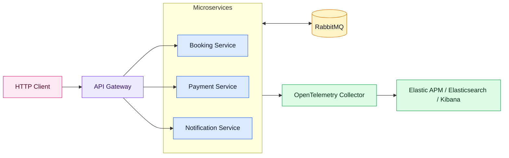
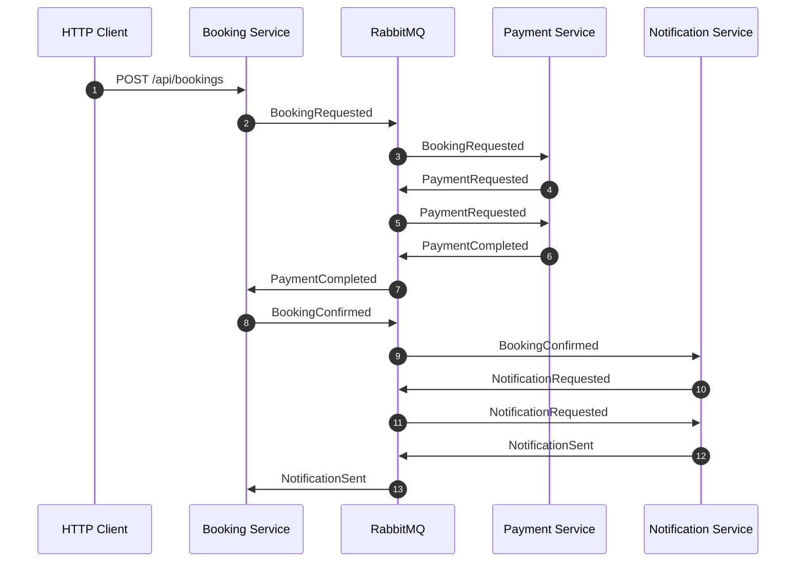
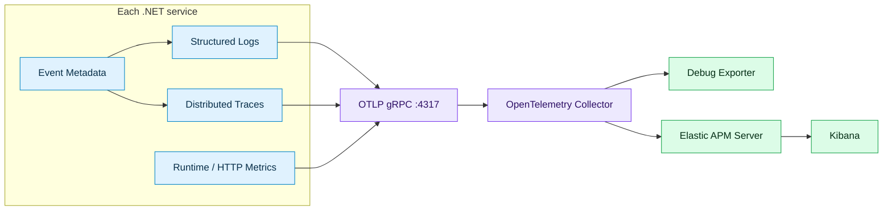
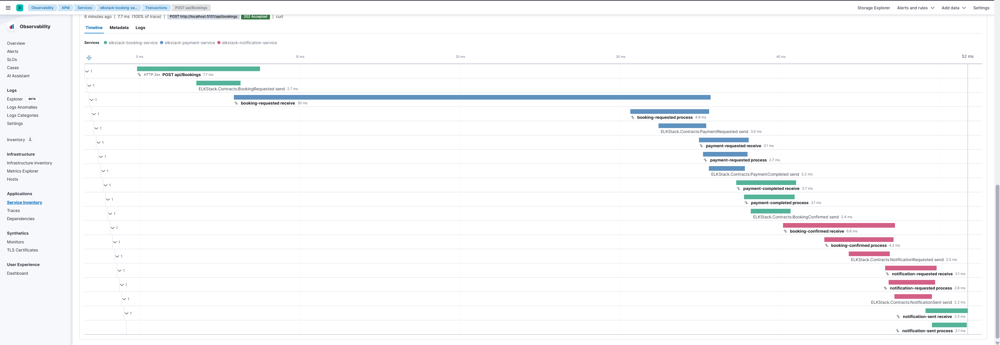

```mermaid
flowchart LR
    A["A: BookingRequested<br/>root"]
    B["B: PaymentRequested<br/>caused by A"]
    C["C: PaymentCompleted<br/>caused by B"]
    D["D: BookingConfirmed<br/>caused by C"]
    E["E: NotificationRequested<br/>caused by D"]
    F["F: NotificationSent<br/>caused by E"]

    A --> B --> C --> D --> E --> F

    classDef root fill:#fee2e2,stroke:#dc2626,color:#450a0a
    classDef payment fill:#fef3c7,stroke:#d97706,color:#422006
    classDef booking fill:#dbeafe,stroke:#2563eb,color:#172554
    classDef notify fill:#dcfce7,stroke:#16a34a,color:#052e16

    class A root
    class B,C payment
    class D booking
    class E,F notify
```

# Observability by Investigation

<p align="right">
  <a href="readme.fa.md"><strong>فارسی</strong></a>
</p>

> A progressive .NET 10 observability workshop in which a distributed booking
> system becomes understandable one investigative capability at a time.

## Course navigation

The repository is the presentation. Start with the deliberately inadequate
system, encounter an investigation question, then open the next solution to
gain the capability needed to answer it.

| Solution | Story beat |
| --- | --- |
| [`00-Orientation.slnx`](solutions/00-Orientation.slnx) | Known monitoring questions vs unknown investigations |
| [`01-Opaque-System.slnx`](solutions/01-Opaque-System.slnx) | Something failed. Where? |
| `02-Queryable-Logs.slnx` *(planned)* | Logs we can actually query |
| `03-Business-Operation.slnx` *(planned)* | Following one operation across services |
| `04-Execution-Structure.slnx` *(planned)* | Correlation is membership, not structure |
| `05-System-Symptoms.slnx` *(planned)* | How did we know there was a problem? |
| `06-Telemetry-Pipeline.slnx` *(planned)* | From application telemetry to Kibana |
| `07-Complete-Investigation.slnx` *(planned)* | Root cause with technical and business context |

See the [course guide](course/README.md) for the progressive narrative. The
current implementation below is the reference full-system baseline; course
profiles will be introduced stage by stage on this branch.

This repository is not meant to be a complete business application. It is a focused demo for a technical presentation: one HTTP request enters a microservice system, turns into a chain of RabbitMQ events, and produces logs, traces, metrics, and correlation metadata that can be followed end to end. Local orchestration is handled by .NET Aspire through [`ELKStack.AppHost`](Aspire/ELKStack.AppHost/AppHost.cs).

The code is intentionally small so the operational story stays visible. Instead of treating telemetry as separate outputs, the demo treats it as one investigation surface for answering a single question: what happened to this business operation?

## Why Observability Matters in Microservices

In a monolith, a failed request often stays inside one process and one log stream. In microservices, the same user action crosses process boundaries, queues, background consumers, retries, and asynchronous side effects. A single business operation can involve several services even when the user only made one HTTP call.

Traditional monitoring answers:

```text
Is the service up?
Is CPU high?
Is request latency high?
```

Observability should answer the harder production questions:

```text
Which service touched this user request?
Which event caused the next event?
Where did the workflow slow down?
Which log lines, spans, and metrics belong to the same business operation?
Can we debug it without guessing across dashboards?
```

This sample is built around those questions, and around the idea that the answer should be reconstructable without manually stitching together several disconnected views.

## Demo System

The solution contains three controller-based services using MassTransit 8 and RabbitMQ:

| Project | Role |
| --- | --- |
| [`ELKStack.BookingService`](src/ELKStack.BookingService/Program.cs) | Accepts booking requests and tracks booking state. |
| [`ELKStack.PaymentService`](src/ELKStack.PaymentService/Program.cs) | Reacts to bookings, requests payment, and completes payment. |
| [`ELKStack.NotificationService`](src/ELKStack.NotificationService/Program.cs) | Reacts to confirmed bookings and sends notifications. |
| [`ELKStack.Contracts`](src/ELKStack.Contracts/IntegrationEvents.cs) | Defines event contracts and metadata: `EventId`, `CorrelationId`, `CausationId`. |
| [`ELKStack.ServiceDefaults`](Aspire/ELKStack.ServiceDefaults/Extensions.cs) | Adds Aspire service discovery, HTTP resilience, health endpoints, structured logging, and OpenTelemetry export. |
| [`ELKStack.Observability`](src/ELKStack.Observability/ObservabilityExtensions.cs) | Adds project-specific correlation propagation for HTTP and MassTransit. |
| [`ELKStack.AppHost`](Aspire/ELKStack.AppHost/AppHost.cs) | Orchestrates RabbitMQ, Elasticsearch, APM Server, Kibana, the OTel Collector, and all three services with Aspire. |

The service state is intentionally in-memory. The point is not persistence. The point is the observability story.

## Architecture



The API Gateway is shown as an optional production-style edge component. It is not implemented in this sample; each service can be called directly.

## The Business Flow

The demo starts with a booking request:

```http
POST http://localhost:5101/api/bookings
Content-Type: application/json
X-Correlation-ID: 4b05c640-2a8a-42c9-a732-75a608f7dc09

{
  "passengerName": "Sara Ahmadi",
  "customerEmail": "sara@example.com",
  "destination": "Berlin",
  "amount": 1490,
  "currency": "EUR"
}
```

[`BookingsController.Create`](src/ELKStack.BookingService/Controllers/BookingsController.cs) publishes `BookingRequested`. From there, the workflow continues asynchronously:



This is the kind of flow where observability becomes necessary. The original HTTP request does not directly execute all work. It starts a distributed chain whose real behavior only becomes clear when request data, message flow, logs, and traces can be inspected together.

## Correlation and Causation

Every event implements [`IIntegrationEvent`](src/ELKStack.Contracts/IntegrationEvents.cs):

```csharp
public interface IIntegrationEvent
{
    Guid EventId { get; }
    DateTimeOffset OccurredAt { get; }
    Guid CorrelationId { get; }
    Guid? CausationId { get; }
}
```

| Field | Purpose |
| --- | --- |
| `CorrelationId` | Links every log, trace, request, and event in the same business workflow. |
| `EventId` | Identifies one event instance. |
| `CausationId` | Points to the parent event that caused the current event. |

The event chain becomes an event tree:



All nodes share the same `CorrelationId`. Each child points to its parent through `CausationId`.

Implementation points:

- [`CorrelationMiddleware`](src/ELKStack.Observability/Correlation/CorrelationMiddleware.cs) creates or reads correlation IDs for HTTP requests.
- [`CorrelationConsumeFilter`](src/ELKStack.Observability/Correlation/CorrelationConsumeFilter.cs) creates a child operation when a MassTransit consumer receives an event.
- [`CorrelationPublishFilter`](src/ELKStack.Observability/Correlation/CorrelationPublishFilter.cs) pushes event metadata into MassTransit headers.

## Observability Pipeline



[`ELKStack.ServiceDefaults`](Aspire/ELKStack.ServiceDefaults/Extensions.cs) wires the shared Aspire baseline:

- Serilog structured logging
- request logging
- OpenTelemetry traces and metrics
- OTLP export
- MassTransit tracing through the `MassTransit` activity source
- service discovery and default HTTP resilience
- health and liveness endpoints

[`ELKStack.Observability`](src/ELKStack.Observability/ObservabilityExtensions.cs) layers in:

- correlation fields in logs and spans
- MassTransit consume/publish filters for event metadata propagation

Runtime infrastructure is now orchestrated primarily by [`ELKStack.AppHost`](Aspire/ELKStack.AppHost/AppHost.cs). The repository still keeps [`docker-compose.yml`](docker-compose.yml) and [`otel-collector-config.yml`](otel-collector-config.yml) for the previous standalone collector/RabbitMQ path.

## Reading the Workflow in Kibana

Once the flow runs, Kibana becomes more than a dashboard destination. It is where the service-level view and the business-operation view start to line up: incoming requests, downstream spans, logs, and metadata can be inspected in the same investigation path.



That matters most during investigation. A correlation ID is useful on its own, but it becomes far more valuable when it can act as a search handle across the telemetry generated by the whole operation.

## Why This Operating Model Fits

Grafana, Loki, Tempo, Prometheus, and Jaeger are strong tools. This demo is not a claim that they are weak. It is a demonstration of what becomes simpler when this kind of event-driven workflow is explored through a search-centric, correlation-friendly Elastic path.

| Investigation need | Why the Elastic path helps here |
| --- | --- |
| Follow one business operation across services | `CorrelationId`, `CausationId`, and `EventId` can sit beside traces and logs instead of being treated as external bookkeeping. |
| Move from symptom to evidence quickly | Elasticsearch makes structured fields and message text natural entry points for investigation. |
| Keep application telemetry vendor-neutral | The services stay OpenTelemetry-first and export through the Collector/APM path. |
| Reduce context switching during diagnosis | Logs, traces, APM data, and related infrastructure signals converge in one observability experience. |
| Preserve a compact demo architecture | The stack communicates a complete investigation workflow without requiring the explanation to jump between several specialized backends. |

The practical incident story is the clearest test:

```text
User reports "booking confirmation is slow"
-> search the CorrelationId in Elastic
-> see the HTTP request, logs, event IDs, and traces together
-> follow CausationId from BookingRequested to NotificationSent
-> identify the slow service or failed event without rebuilding the workflow in your head
```

For this kind of event-driven microservice system, the win is not just telemetry collection. The win is shortening the distance between "something is wrong" and "this operation explains why."

## Run the Demo

Start the Aspire app host:

```powershell
dotnet run --project Aspire/ELKStack.AppHost/ELKStack.AppHost.csproj
```

Create a booking:

```powershell
$correlationId = [guid]::NewGuid()

Invoke-RestMethod http://localhost:5101/api/bookings `
  -Method Post `
  -ContentType 'application/json' `
  -Headers @{ 'X-Correlation-ID' = $correlationId } `
  -Body '{"passengerName":"Sara Ahmadi","customerEmail":"sara@example.com","destination":"Berlin","amount":1490,"currency":"EUR"}'
```

## Sources

- [Elastic Observability overview](https://www.elastic.co/docs/solutions/observability)
- [Elastic OpenTelemetry docs](https://www.elastic.co/docs/solutions/observability/apm/opentelemetry)
- [Grafana Stack overview](https://grafana.com/about/grafana-stack/)
- [Grafana telemetry type guide](https://grafana.com/docs/learning-hub/intro-to-data-sources/00-overview/03-telemetry-types/)
- [Loki query docs](https://grafana.com/docs/loki/latest/logql/)
- [Loki meta-monitoring docs](https://grafana.com/docs/loki/latest/operations/meta-monitoring/)
- [Tempo metrics-from-traces docs](https://grafana.com/docs/tempo/latest/getting-started/metrics-from-traces/)
