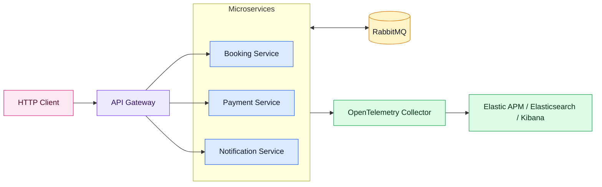
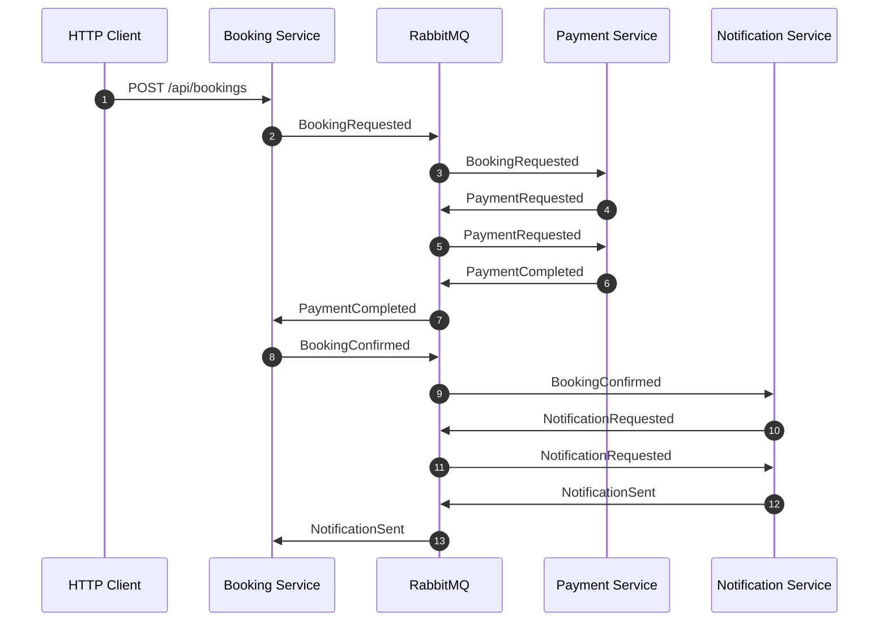
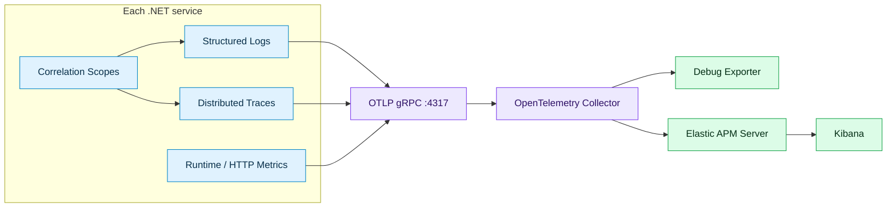

# ELKStack

<p align="right">
  <a href="readme.fa.md"><strong>فارسی</strong></a>
</p>

> A .NET 8 microservice sample for demonstrating an ELK + APM Server + OpenTelemetry Collector observability stack over a real event-driven flow.

`ELKStack` contains three controller-based services that communicate through RabbitMQ using MassTransit 8. Each service can receive HTTP requests, publish integration events, consume events, produce structured logs, and export telemetry through OpenTelemetry.

## Solution Projects

| Project | Responsibility |
| --- | --- |
| [`ELKStack.Contracts`](src/ELKStack.Contracts/IntegrationEvents.cs) | Shared integration events and event metadata contracts. |
| [`ELKStack.Observability`](src/ELKStack.Observability/ObservabilityExtensions.cs) | Shared structured logging, correlation, MassTransit filters, and OpenTelemetry export setup. |
| [`ELKStack.BookingService`](src/ELKStack.BookingService/Program.cs) | HTTP booking entry point, booking state, booking lifecycle consumers. |
| [`ELKStack.PaymentService`](src/ELKStack.PaymentService/Program.cs) | Payment request and payment completion workflow. |
| [`ELKStack.NotificationService`](src/ELKStack.NotificationService/Program.cs) | Notification request and notification sent workflow. |

## Architecture



The API Gateway is shown as an optional edge component for a production-style topology. It is not implemented in this sample code; the three services can be called directly.

The services are intentionally small and in-memory. That keeps the presentation focused on distributed tracing, event causality, structured logs, and telemetry export rather than database or persistence concerns.

## Request Entry Point

The normal demo starts with this HTTP request:

```http
POST http://localhost:5101/api/bookings
Content-Type: application/json
X-Correlation-ID: 4b05c640-2a8a-42c9-a732-75a608f7dc09

{
  "passengerName": "Sara Ahmadi",
  "customerEmail": "sara@example.com",
  "destination": "Berlin",
  "amount": 1490,
  "currency": "EUR"
}
```

The request reaches [`BookingsController.Create`](src/ELKStack.BookingService/Controllers/BookingsController.cs), which creates a `BookingRequested` event and publishes it:

```csharp
var metadata = correlationContext.CreateMetadata();
var message = new BookingRequested(
    Guid.NewGuid(),
    request.PassengerName,
    request.CustomerEmail,
    request.Destination,
    request.Amount,
    request.Currency.ToUpperInvariant(),
    DateTimeOffset.UtcNow,
    metadata.EventId,
    metadata.CorrelationId,
    metadata.CausationId);

await publishEndpoint.Publish(message, cancellationToken);
```

At this point, an HTTP request has become the root of an event chain.

## Correlation and Causation

The system tracks two different relationships:

| Field | Meaning | Example |
| --- | --- | --- |
| `CorrelationId` | The whole workflow ID. Every event caused by one user action shares it. | "Everything that happened because of this booking request." |
| `CausationId` | The direct parent event ID. This creates the event tree. | "`PaymentCompleted` was caused by `PaymentRequested`." |
| `EventId` | Unique ID for one event instance. | "`BookingRequested` event #A." |

All integration events implement [`IIntegrationEvent`](src/ELKStack.Contracts/IntegrationEvents.cs):

```csharp
public interface IIntegrationEvent
{
    Guid EventId { get; }
    DateTimeOffset OccurredAt { get; }
    Guid CorrelationId { get; }
    Guid? CausationId { get; }
}
```

For HTTP requests, [`CorrelationMiddleware`](src/ELKStack.Observability/Correlation/CorrelationMiddleware.cs):

- reads `X-Correlation-ID` if the client supplied it
- falls back to `X-Request-ID`
- generates a new correlation ID when neither exists
- stores the current operation in `ICorrelationContextAccessor`
- adds correlation fields to log scopes and OpenTelemetry activity tags
- returns the correlation values as response headers

For events, [`CorrelationConsumeFilter`](src/ELKStack.Observability/Correlation/CorrelationConsumeFilter.cs) and [`CorrelationPublishFilter`](src/ELKStack.Observability/Correlation/CorrelationPublishFilter.cs) connect MassTransit to the same model.

When a consumer receives an event, the current operation becomes a child operation:

```csharp
public static CorrelationContext CreateForConsumedEvent(IIntegrationEvent message) =>
    new(Guid.NewGuid(), message.CorrelationId, message.EventId);
```

That means every new event published from the consumer gets:

- the same `CorrelationId`
- a new `EventId`
- `CausationId` set to the consumed event's `EventId`

## Event Chain



<br/>

### Event Tree

```mermaid
flowchart LR
    A["A: BookingRequested<br/>root"]
    B["B: PaymentRequested<br/>caused by A"]
    C["C: PaymentCompleted<br/>caused by B"]
    D["D: BookingConfirmed<br/>caused by C"]
    E["E: NotificationRequested<br/>caused by D"]
    F["F: NotificationSent<br/>caused by E"]

    A --> B --> C --> D --> E --> F

    classDef root fill:#fee2e2,stroke:#dc2626,color:#450a0a
    classDef payment fill:#fef3c7,stroke:#d97706,color:#422006
    classDef booking fill:#dbeafe,stroke:#2563eb,color:#172554
    classDef notify fill:#dcfce7,stroke:#16a34a,color:#052e16

    class A root
    class B,C payment
    class D booking
    class E,F notify
```



Every box in this tree has the same `CorrelationId`. The parent-child relationship is created by `CausationId`.

<br/>

## Observability Flow



The shared setup is in [`ObservabilityExtensions`](src/ELKStack.Observability/ObservabilityExtensions.cs):

- `AddElkStackObservability()` configures Serilog, OpenTelemetry, correlation services, health checks, and HTTP logging.
- `UseElkStackObservability()` adds correlation middleware, HTTP logging, Serilog request logging, and health endpoints.
- `UseCorrelationFilters()` adds MassTransit consume/publish filters for event metadata propagation.

### Structured Logging

The services use Serilog for structured logs and enrich records with service, environment, request, correlation, causation, and operation fields. Relevant code: [`AddStructuredLogging`](src/ELKStack.Observability/ObservabilityExtensions.cs).

### OpenTelemetry

The services export:

- ASP.NET Core traces
- HTTP client traces
- MassTransit traces through the `MassTransit` activity source
- runtime metrics
- HTTP metrics
- structured logs through OpenTelemetry logging and Serilog OTLP sink

Relevant code: [`AddOpenTelemetryExport`](src/ELKStack.Observability/ObservabilityExtensions.cs).

## Runtime Components

[`docker-compose.yml`](docker-compose.yml) starts:

| Component | Port | Purpose |
| --- | --- | --- |
| RabbitMQ | `5672` | MassTransit message transport. |
| RabbitMQ Management | `15672` | Browser UI for exchanges, queues, and messages. |
| OpenTelemetry Collector gRPC | `4317` | Receives telemetry from the services. |
| OpenTelemetry Collector HTTP | `4318` | Optional OTLP HTTP receiver. |

The collector configuration is in [`otel-collector-config.yml`](otel-collector-config.yml). It receives OTLP telemetry, batches it, writes to the debug exporter, and forwards to Elastic APM.

```yaml
exporters:
  debug:
    verbosity: basic
  otlp/elastic:
    endpoint: ${ELASTIC_APM_ENDPOINT}
    tls:
      insecure: true
```

## Run Locally

Create a booking:

```powershell
$correlationId = [guid]::NewGuid()

Invoke-RestMethod http://localhost:5101/api/bookings `
  -Method Post `
  -ContentType 'application/json' `
  -Headers @{ 'X-Correlation-ID' = $correlationId } `
  -Body '{"passengerName":"Sara Ahmadi","customerEmail":"sara@example.com","destination":"Berlin","amount":1490,"currency":"EUR"}'
```

## ELK APM vs Grafana Stack

Grafana, Loki, Tempo, Prometheus, and Jaeger are strong tools. The argument for this sample is not that they are weak; it is that the Elastic + APM Server + OpenTelemetry Collector path gives the team a more consolidated operating model for this kind of distributed, event-driven system.

| Decision point | Elastic + APM + OTel Collector | Grafana/Loki/Tempo/Prometheus shape |
| --- | --- | --- |
| Cross-signal investigation | Logs, metrics, traces, APM, infrastructure, and related signals are handled in one Elastic Observability experience. | The stack is commonly split by signal: Loki for logs, Tempo/Jaeger for traces, Prometheus/Mimir for metrics, Grafana for visualization. |
| OpenTelemetry fit | Elastic supports OTLP ingest through OpenTelemetry Collector/APM paths, so this code can stay OTel-first. | Also supports OTel, but teams still operate several specialized backends and data source integrations. |
| Debugging this workflow | `CorrelationId`, `CausationId`, and `EventId` can be searched and correlated in the same platform as traces and logs. | Correlation usually depends on datasource linking, label conventions, and query discipline across separate systems. |
| Operational surface | One primary search/analytics backend and one UI path for the demo story. | More moving parts: log backend, trace backend, metrics backend, visualization layer, and meta-monitoring for those systems. |
| Full-text log search | Elasticsearch is built around indexed search, so searching arbitrary structured log fields and message text is a natural fit. | Grafana itself is a UI, and Loki is label-first: official Loki docs state that it indexes timestamps and labels, not the rest of the log line. Log text can be filtered with LogQL after selecting streams, but it is not Elasticsearch-style full-text indexing. |

The most persuasive point for this project is the incident workflow:

```text
User reports "booking confirmation is slow"
-> search the CorrelationId in Elastic
-> see the HTTP request, logs, event IDs, and traces together
-> follow CausationId from BookingRequested to NotificationSent
-> identify the slow service or failed event without switching mental models
```

This is exactly why the sample emphasizes correlation and causation metadata. The technology choice is not just about collecting telemetry; it is about reducing the time between "something is wrong" and "this event in this service caused it."

Sources:

- [Elastic Observability overview](https://www.elastic.co/docs/solutions/observability) describes Elastic as a unified observability platform for logs, metrics, traces, APM, infrastructure, and related operational data.
- [Elastic OpenTelemetry docs](https://www.elastic.co/docs/solutions/observability/apm/opentelemetry) document native OTLP/OpenTelemetry paths through the Collector, APM Server, and Elastic-managed endpoints.
- [Grafana Stack overview](https://grafana.com/about/grafana-stack/) presents the Grafana ecosystem as separate products for logs, traces, metrics, and profiles.
- [Grafana telemetry type guide](https://grafana.com/docs/learning-hub/intro-to-data-sources/00-overview/03-telemetry-types/) explicitly frames Prometheus for metrics and Loki for logs.
- [Loki query docs](https://grafana.com/docs/loki/latest/logql/) state that Loki indexes timestamps and labels, not the rest of the log line.
- [Loki meta-monitoring docs](https://grafana.com/docs/loki/latest/operations/meta-monitoring/) show the extra production concern of monitoring the logging stack itself, including metrics cardinality and separate monitoring.
- [Tempo metrics-from-traces docs](https://grafana.com/docs/tempo/latest/getting-started/metrics-from-traces/) show that trace-derived metrics need Tempo features such as metrics-generator/TraceQL metrics and may write to Prometheus-compatible storage.
