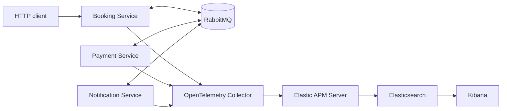

# Observability: one system, one investigation

<p align="right"><a href="readme.fa.md"><strong>فارسی</strong></a></p>

This repository is a 30-minute, backend-focused observability presentation.
It introduces the fundamentals, then uses one final .NET system to show logs,
metrics, traces, OpenTelemetry, RabbitMQ context propagation, and Elastic
together.

It is deliberately not a multi-stage course. Open one solution:

```text
ELKStack.slnx
```

## The 30-minute flow

| Time | Topic | Speaker notes |
| --- | --- | --- |
| 0–3 | Fundamental problem | [Why observability?](talk/README.md#1-the-fundamental-problem) |
| 3–8 | Logs, metrics, traces | [Different evidence](talk/README.md#2-logs-metrics-and-traces) |
| 8–11 | Structured logs and Serilog | [Queryable evidence](talk/README.md#3-structured-logs-and-serilog) |
| 11–17 | OpenTelemetry | [Vendor-neutral telemetry](talk/README.md#4-opentelemetry-vendor-neutral-by-design) |
| 17–20 | Agents vs code instrumentation | [Comparison](talk/README.md#5-zero-code-agents-vs-code-based-instrumentation) |
| 20–22 | Java, Python, ASP.NET Core | [One standard](talk/README.md#6-one-standard-across-ecosystems) |
| 22–24 | Tool landscape | [Common tools](talk/README.md#7-tool-landscape) |
| 24–26 | Why Elastic | [Case for Elastic](talk/README.md#8-why-elastic-observability-for-this-demo) |
| 26–30 | Live investigation | [Demo script](talk/README.md#9-live-demo-script) |

Persian speaker notes: [talk/README.fa.md](talk/README.fa.md).

## The final demo system

```text
POST /api/bookings
  → Booking Service → RabbitMQ → Payment Service
  → RabbitMQ → Booking Service → RabbitMQ → Notification Service
```

| Project | Role |
| --- | --- |
| [BookingService](src/ELKStack.BookingService/Program.cs) | Accepts bookings and tracks status. |
| [PaymentService](src/ELKStack.PaymentService/Program.cs) | Requests, completes, or fails payment. |
| [NotificationService](src/ELKStack.NotificationService/Program.cs) | Sends notifications. |
| [Contracts](src/ELKStack.Contracts/IntegrationEvents.cs) | Events plus `EventId`, `CorrelationId`, `CausationId`. |
| [Observability](src/ELKStack.Observability/ObservabilityExtensions.cs) | Business correlation for HTTP and MassTransit. |
| [Service Defaults](Aspire/ELKStack.ServiceDefaults/Extensions.cs) | Serilog, OpenTelemetry, health checks. |
| [AppHost](Aspire/ELKStack.AppHost/AppHost.cs) | RabbitMQ, Elastic, Kibana, Collector, and services. |

## Run the live demo

```powershell
dotnet run --project Aspire/ELKStack.AppHost/ELKStack.AppHost.csproj
```

Send a failing booking to the Booking Service endpoint shown by Aspire:

```json
{
  "passengerName": "Sara Ahmadi",
  "customerEmail": "sara@example.com",
  "destination": "Berlin",
  "amount": 1490,
  "currency": "EUR",
  "scenario": "PaymentFailure"
}
```

## Architecture




## Key idea

```text
Metric: payment failures increased
  → Trace: PaymentService spent time here
    → Log: provider rejected this payment
      → Business context: these events belong to this booking workflow
```

Observability is not ELK, OpenTelemetry, or a checklist of three signals. It
is the ability to answer production questions from connected evidence.
