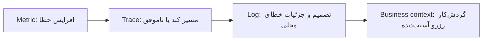
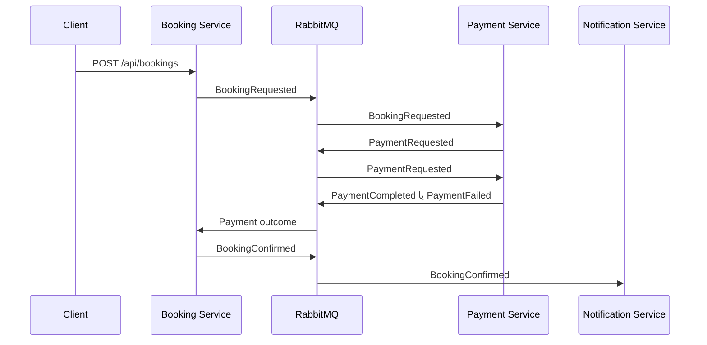
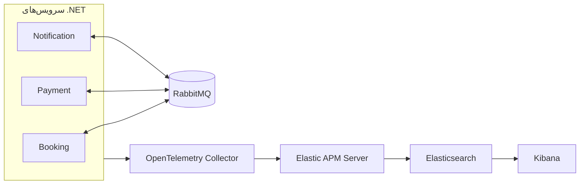

<div dir="rtl">

# راهنمای فنی: مشاهده‌پذیری در یک سامانهٔ توزیع‌شدهٔ .NET

[English](README.technical.md)

این مخزن یک راهنمای عملی برای درک مشاهده‌پذیری در یک سامانهٔ رویدادمحور .NET است. ابتدا توضیح می‌دهد logs، metrics، traces، لاگ ساخت‌یافته، OpenTelemetry و Elastic چرا وجود دارند؛ سپس همهٔ آن‌ها را در یک گردش‌کار رزرو واقعی کنار هم نشان می‌دهد.

برای بررسی سامانهٔ کامل، [ELKStack.slnx](ELKStack.slnx) را باز کنید. برای مفاهیم پشت این پیاده‌سازی، [راهنمای اصلی مشاهده‌پذیری](README.fa.md) را بخوانید.

## پرسشی که این مخزن پاسخ می‌دهد

> «مشتری تلاش کرده است رزرو ایجاد کند، اما مشکلی رخ داده است. چه اتفاقی افتاد؟»

در یک سامانهٔ توزیع‌شده، یک اقدام کاربر می‌تواند از HTTP، چند سرویس، صف، مصرف‌کنندهٔ پس‌زمینه و وابستگی‌های بیرونی عبور کند. یک سامانهٔ مشاهده‌پذیر خوب به مهندس اجازه می‌دهد از یک نشانهٔ کلی به شواهد مربوط به یک عملیات مشخص برسد.



مشاهده‌پذیری نام یک محصول نیست و فقط «logs + metrics + traces» هم نیست؛ یعنی بتوانیم با شواهد مرتبط و مفید به پرسش‌های محیط عملیاتی پاسخ دهیم.

## آنچه در اینجا پیدا می‌کنید

| موضوع | دلیل اهمیت |
| --- | --- |
| [logs، metrics و traces](README.fa.md#logs-metrics-و-traces) | هر سیگنال به یک پرسش متفاوت در بررسی رخداد پاسخ می‌دهد. |
| [لاگ ساخت‌یافته و Serilog](README.fa.md#structured-logs-و-serilog) | فیلدهای قابل جست‌وجو از تحلیل جمله‌های متنی قدرتمندترند. |
| [OpenTelemetry](README.fa.md#opentelemetry) | مرزی مستقل از فروشنده برای instrumentation و انتقال telemetry. |
| [instrumentation خودکار و کدنویسی‌شده](README.fa.md#instrumentation-خودکار-و-کدنویسیشده) | سطح مناسب کنترل را انتخاب کنید. |
| [ابزارها](README.fa.md#چشمانداز-ابزارها) | جای Prometheus، Tempo، Jaeger، Elastic، Loki و دیگر ابزارها را ببینید. |
| [چرا Elastic در این دمو](README.fa.md#چرا-elastic-observability) | یک سطح جست‌وجو و بررسی واحد برای این گردش‌کار. |

## نمونهٔ در حال اجرا

سه سرویس عمداً وضعیت کسب‌وکار را در حافظه نگه می‌دارند تا تمرکز روی داستان عملیاتی باشد، نه persistence.



| پروژه | مسئولیت |
| --- | --- |
| [BookingService](src/ELKStack.BookingService/Program.cs) | درخواست رزرو را می‌پذیرد و وضعیت آن را پیگیری می‌کند. |
| [PaymentService](src/ELKStack.PaymentService/Program.cs) | پرداخت را پردازش و نتیجهٔ موفق/ناموفق را منتشر می‌کند. |
| [NotificationService](src/ELKStack.NotificationService/Program.cs) | به رزرو تأییدشده واکنش نشان می‌دهد. |
| [Contracts](src/ELKStack.Contracts/IntegrationEvents.cs) | قرارداد رویدادها و شناسه‌های کسب‌وکار. |
| [Observability](src/ELKStack.Observability/ObservabilityExtensions.cs) | propagation شناسه‌های correlation و causation. |
| [Service Defaults](Aspire/ELKStack.ServiceDefaults/Extensions.cs) | Serilog، OpenTelemetry، health و پیش‌فرض‌های مشترک میزبان. |
| [AppHost](Aspire/ELKStack.AppHost/AppHost.cs) | RabbitMQ، Collector، Elastic، Kibana و سرویس‌ها را اجرا می‌کند. |

## اجرا

```powershell
dotnet run --project Aspire/ELKStack.AppHost/ELKStack.AppHost.csproj
```

از endpoint سرویس Booking که در داشبورد Aspire نمایش داده می‌شود استفاده کنید. درخواست زیر یک شکست واقعی کسب‌وکاری می‌سازد که قابل بررسی است:

```json
{
  "passengerName": "Sara Ahmadi",
  "customerEmail": "sara@example.com",
  "destination": "Berlin",
  "amount": 1490,
  "currency": "EUR",
  "scenario": "PaymentFailure"
}
```

با نشانهٔ شکست شروع کنید، فیلدهای ساخت‌یافته‌ای مثل `BookingId`، `PaymentId` و `Reason` را بررسی کنید و سپس trace و شناسه‌های کسب‌وکاری را دنبال کنید.

## معماری




</div>
