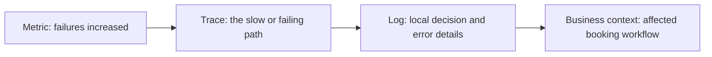
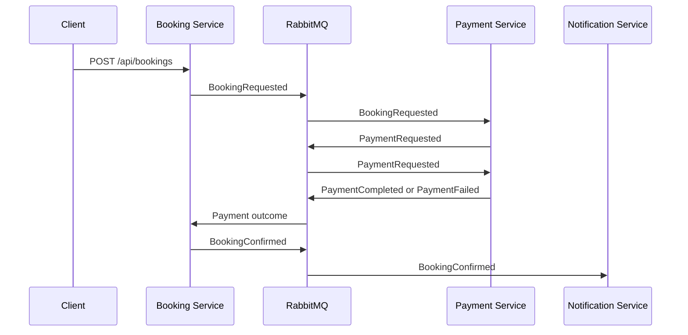
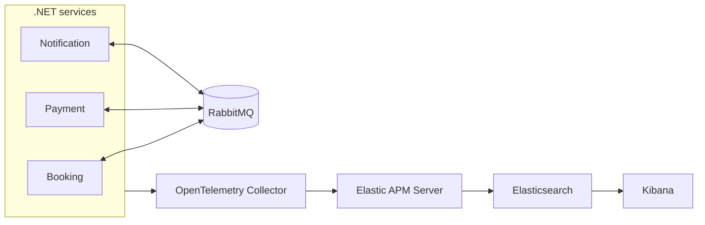

# Technical guide: observability in a distributed .NET system

<p align="right"><a href="README.technical.fa.md"><strong>فارسی</strong></a></p>

This repository is a practical guide to understanding observability in an
event-driven .NET system. It explains why logs, metrics, traces, structured
logging, OpenTelemetry, and Elastic exist—and then demonstrates them together
in one booking workflow.

Open [ELKStack.slnx](ELKStack.slnx) to explore the complete system. Read the
[main observability guide](README.md) for the concepts behind it.

## The question this repository answers

> “A customer tried to make a booking. Something went wrong. What happened?”

In a distributed system, one user action may cross HTTP, services, queues,
background consumers, and third-party dependencies. A useful observability
system lets engineers move from a broad symptom to evidence for one operation.



Observability is not a product name and not merely “logs + metrics + traces.”
It is the ability to answer production questions from connected, useful
evidence.

## What you will find here

| Topic | Why it matters |
| --- | --- |
| [Logs, metrics, and traces](talk/README.md#logs-metrics-and-traces) | Each signal answers a different investigative question. |
| [Structured logs and Serilog](talk/README.md#structured-logs-and-serilog) | Searchable fields are stronger than parsing sentences. |
| [OpenTelemetry](talk/README.md#opentelemetry) | A vendor-neutral instrumentation and transport boundary. |
| [Automatic vs code instrumentation](talk/README.md#automatic-and-code-based-instrumentation) | Choose the right level of control. |
| [Tool landscape](talk/README.md#tool-landscape) | See where Prometheus, Tempo, Jaeger, Elastic, Loki, and others fit. |
| [Why Elastic in this demo](talk/README.md#why-elastic-observability) | One search-oriented investigation surface for this workflow. |

## The running example

The three services deliberately keep business state in memory so the focus
stays on the operational story rather than persistence.



| Project | Responsibility |
| --- | --- |
| [BookingService](src/ELKStack.BookingService/Program.cs) | Accepts booking requests and tracks status. |
| [PaymentService](src/ELKStack.PaymentService/Program.cs) | Processes payment and emits success/failure outcomes. |
| [NotificationService](src/ELKStack.NotificationService/Program.cs) | Reacts to confirmed bookings. |
| [Contracts](src/ELKStack.Contracts/IntegrationEvents.cs) | Event contracts and business identifiers. |
| [Observability](src/ELKStack.Observability/ObservabilityExtensions.cs) | Correlation and causation propagation. |
| [Service Defaults](Aspire/ELKStack.ServiceDefaults/Extensions.cs) | Serilog, OpenTelemetry, health, and shared host defaults. |
| [AppHost](Aspire/ELKStack.AppHost/AppHost.cs) | Runs RabbitMQ, Collector, Elastic, Kibana, and services. |

## Run it

```powershell
dotnet run --project Aspire/ELKStack.AppHost/ELKStack.AppHost.csproj
```

Use the Booking Service endpoint shown in the Aspire dashboard. This request
creates a real business failure that can be investigated:

```json
{
  "passengerName": "Sara Ahmadi",
  "customerEmail": "sara@example.com",
  "destination": "Berlin",
  "amount": 1490,
  "currency": "EUR",
  "scenario": "PaymentFailure"
}
```

Start with the failure symptom, inspect structured fields such as `BookingId`,
`PaymentId`, and `Reason`, then follow the trace and business identifiers.

## Architecture




