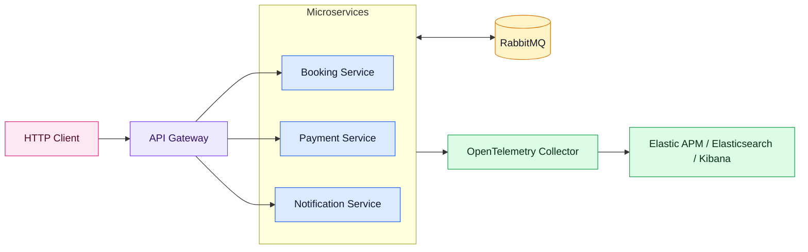
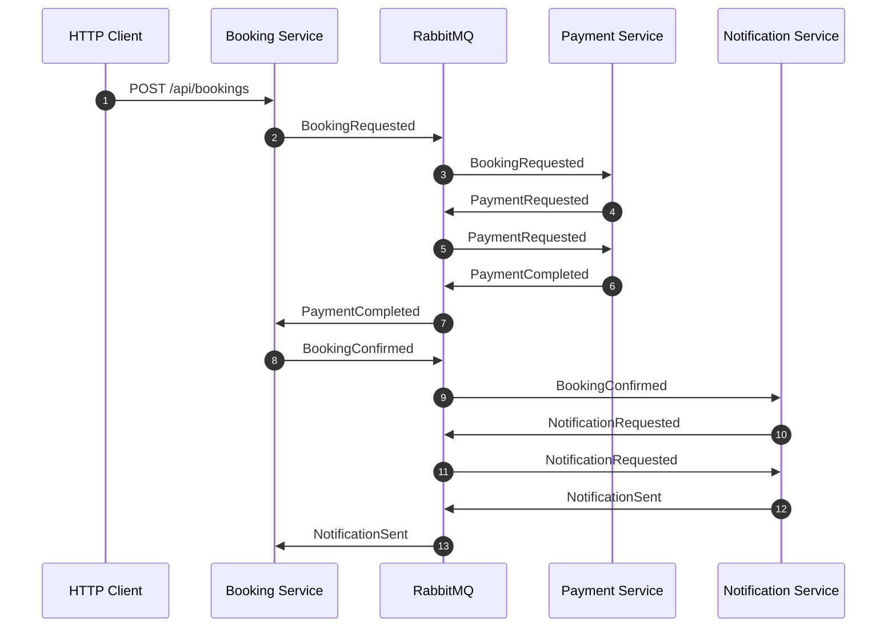
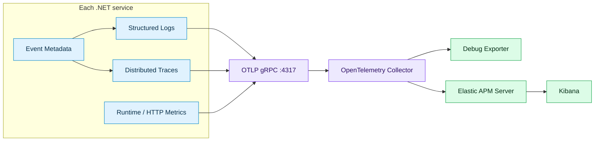

```mermaid
flowchart LR
    A["A: BookingRequested<br/>root"]
    B["B: PaymentRequested<br/>caused by A"]
    C["C: PaymentCompleted<br/>caused by B"]
    D["D: BookingConfirmed<br/>caused by C"]
    E["E: NotificationRequested<br/>caused by D"]
    F["F: NotificationSent<br/>caused by E"]

    A --> B --> C --> D --> E --> F

    classDef root fill:#fee2e2,stroke:#dc2626,color:#450a0a
    classDef payment fill:#fef3c7,stroke:#d97706,color:#422006
    classDef booking fill:#dbeafe,stroke:#2563eb,color:#172554
    classDef notify fill:#dcfce7,stroke:#16a34a,color:#052e16

    class A root
    class B,C payment
    class D booking
    class E,F notify
```

<h1 dir="rtl" align="right">مشاهده‌پذیری با رویکرد تحقیق</h1>

<p dir="rtl" align="right">
  <a href="README.md"><strong>English</strong></a>
</p>

<div dir="rtl" align="right">

## مسیر کارگاه

هر درس راهنمای فارسی و solution خودش را در پوشهٔ `course/` دارد:

| مرحله | راهنما | Solution |
| --- | --- | --- |
| ۰۰ | [شروع: پایش در برابر تحقیق](course/00-orientation/README.fa.md) | [00-Orientation.slnx](course/00-orientation/00-Orientation.slnx) |
| ۰۱ | [سامانهٔ مبهم](course/01-opaque-system/README.fa.md) | [01-Opaque-System.slnx](course/01-opaque-system/01-Opaque-System.slnx) |
| ۰۲ | [لاگ قابل جست‌وجو](course/02-queryable-logs/README.fa.md) | [02-Queryable-Logs.slnx](course/02-queryable-logs/02-Queryable-Logs.slnx) |
| ۰۳ | [عملیات کسب‌وکاری](course/03-business-operation/README.fa.md) | [03-Business-Operation.slnx](course/03-business-operation/03-Business-Operation.slnx) |
| ۰۴ | [ساختار اجرا](course/04-execution-structure/README.fa.md) | [04-Execution-Structure.slnx](course/04-execution-structure/04-Execution-Structure.slnx) |
| ۰۵ | [نشانه‌های سامانه](course/05-system-symptoms/README.fa.md) | [05-System-Symptoms.slnx](course/05-system-symptoms/05-System-Symptoms.slnx) |
| ۰۶ | [خط لولهٔ telemetry](course/06-telemetry-pipeline/README.fa.md) | [06-Telemetry-Pipeline.slnx](course/06-telemetry-pipeline/06-Telemetry-Pipeline.slnx) |
| ۰۷ | [تحقیق کامل](course/07-complete-investigation/README.fa.md) | [07-Complete-Investigation.slnx](course/07-complete-investigation/07-Complete-Investigation.slnx) |

</div>

<p dir="rtl" align="right">
یک نمونه عملی میکروسرویسی با <span dir="ltr">.NET 10</span> برای توضیح مشاهده پذیری، رهگیری توزیع شده، همبستگی رویدادها، و این که وقتی لاگ، تریس، متریک و متادیتای جریان کاری در یک مسیر قابل بررسی باشند چه چیزی تغییر می کند.
</p>

<p dir="rtl" align="right">
این مخزن قرار نیست یک سامانه کسب و کاری کامل باشد. هدف آن یک دموی متمرکز برای ارائه فنی است: یک درخواست <span dir="ltr">HTTP</span> وارد سیستم می شود، به زنجیره ای از رویدادهای <span dir="ltr">RabbitMQ</span> تبدیل می شود، و لاگ، تریس، متریک و متادیتای همبستگی تولید می کند که از ابتدا تا انتها قابل دنبال کردن هستند. اجرای محلی این سناریو با <span dir="ltr">.NET Aspire</span> و پروژه <a href="Aspire/ELKStack.AppHost/AppHost.cs"><span dir="ltr">ELKStack.AppHost</span></a> انجام می شود.
</p>

<p dir="rtl" align="right">
کد عمدا کوچک نگه داشته شده تا داستان عملیاتی سیستم واضح بماند. این دمو telemetry را چند خروجی جداگانه نمی بیند؛ آن را یک سطح تحقیقاتی واحد برای پاسخ دادن به یک پرسش می داند: برای این عملیات کسب و کاری دقیقا چه اتفاقی افتاد؟
</p>

<h2 dir="rtl" align="right">چرا Observability در میکروسرویس مهم است</h2>

<p dir="rtl" align="right">
در یک مونولیت، یک درخواست ناموفق اغلب داخل یک پردازه و یک جریان لاگ باقی می ماند. در میکروسرویس ها همان اقدام کاربر از مرز پردازه ها، صف ها، consumerهای پس زمینه، retryها و side effectهای ناهمگام عبور می کند. یک عملیات کسب و کاری می تواند چند سرویس را درگیر کند، حتی اگر کاربر فقط یک درخواست فرستاده باشد.
</p>

<p dir="rtl" align="right">پایش سنتی معمولا به این پرسش ها پاسخ می دهد:</p>

```text
Is the service up?
Is CPU high?
Is request latency high?
```

<p dir="rtl" align="right">اما مشاهده پذیری باید به پرسش های سخت تر پاسخ دهد:</p>

```text
Which service touched this user request?
Which event caused the next event?
Where did the workflow slow down?
Which log lines, spans, and metrics belong to the same business operation?
Can we debug it without guessing across dashboards?
```

<p dir="rtl" align="right">
این نمونه دقیقا حول همین پرسش ها ساخته شده است؛ با این فرض که پاسخ باید بدون دوختن دستی چند نمای نامرتبط به هم قابل بازسازی باشد.
</p>

<h2 dir="rtl" align="right">سیستم دمو</h2>

<p dir="rtl" align="right">
راه حل شامل سه سرویس مبتنی بر controller است که با <span dir="ltr">MassTransit 8</span> و <span dir="ltr">RabbitMQ</span> کار می کنند:
</p>

<table dir="rtl" align="right">
  <thead>
    <tr>
      <th align="right">پروژه</th>
      <th align="right">نقش</th>
    </tr>
  </thead>
  <tbody>
    <tr>
      <td align="left"><a href="src/ELKStack.BookingService/Program.cs">ELKStack.BookingService</a></td>
      <td align="right">درخواست رزرو را می پذیرد و وضعیت رزرو را نگه می دارد.</td>
    </tr>
    <tr>
      <td align="left"><a href="src/ELKStack.PaymentService/Program.cs">ELKStack.PaymentService</a></td>
      <td align="right">به رزرو واکنش نشان می دهد، پرداخت را درخواست می کند و آن را کامل می کند.</td>
    </tr>
    <tr>
      <td align="left"><a href="src/ELKStack.NotificationService/Program.cs">ELKStack.NotificationService</a></td>
      <td align="right">به رزرو تایید شده واکنش نشان می دهد و اعلان ارسال می کند.</td>
    </tr>
    <tr>
      <td align="left"><a href="src/ELKStack.Contracts/IntegrationEvents.cs">ELKStack.Contracts</a></td>
      <td align="right">قراردادهای رویداد و متادیتای <code>EventId</code>، <code>CorrelationId</code> و <code>CausationId</code> را تعریف می کند.</td>
    </tr>
    <tr>
      <td align="left"><a href="Aspire/ELKStack.ServiceDefaults/Extensions.cs">ELKStack.ServiceDefaults</a></td>
      <td align="right">service discovery، resilience پیش فرض HTTP، health endpointها، لاگ ساخت یافته و خروجی OpenTelemetry را اضافه می کند.</td>
    </tr>
    <tr>
      <td align="left"><a href="src/ELKStack.Observability/ObservabilityExtensions.cs">ELKStack.Observability</a></td>
      <td align="right">انتقال correlation ویژه این پروژه را برای HTTP و MassTransit اضافه می کند.</td>
    </tr>
    <tr>
      <td align="left"><a href="Aspire/ELKStack.AppHost/AppHost.cs">ELKStack.AppHost</a></td>
      <td align="right">RabbitMQ، Elasticsearch، APM Server، Kibana، OTel Collector و هر سه سرویس را با Aspire اجرا می کند.</td>
    </tr>
  </tbody>
</table>

<p dir="rtl" align="right">
وضعیت سرویس ها عمدا در حافظه نگه داشته شده است. موضوع این نمونه persistence نیست؛ موضوع داستان مشاهده پذیری است.
</p>

<h2 dir="rtl" align="right">معماری</h2>



<p dir="rtl" align="right">
در این نمودار، <span dir="ltr">API Gateway</span> فقط به عنوان یک لبه اختیاری production-style نمایش داده شده است. این بخش در نمونه پیاده سازی نشده و هر سرویس را می توان مستقیم فراخوانی کرد.
</p>

<h2 dir="rtl" align="right">جریان کسب و کاری</h2>

<p dir="rtl" align="right">دمو با این درخواست رزرو شروع می شود:</p>

```http
POST http://localhost:5101/api/bookings
Content-Type: application/json
X-Correlation-ID: 4b05c640-2a8a-42c9-a732-75a608f7dc09

{
  "passengerName": "Sara Ahmadi",
  "customerEmail": "sara@example.com",
  "destination": "Berlin",
  "amount": 1490,
  "currency": "EUR"
}
```

<p dir="rtl" align="right">
متد <a href="src/ELKStack.BookingService/Controllers/BookingsController.cs"><span dir="ltr">BookingsController.Create</span></a> رویداد <span dir="ltr">BookingRequested</span> را منتشر می کند. از آنجا به بعد، جریان به شکل ناهمگام ادامه پیدا می کند:
</p>



<p dir="rtl" align="right">
این همان جایی است که observability ضروری می شود. درخواست اولیه HTTP همه کارها را مستقیم اجرا نمی کند؛ زنجیره ای توزیع شده را آغاز می کند که رفتار واقعی آن فقط وقتی روشن می شود که داده درخواست، جریان پیام، لاگ ها و تریس ها کنار هم دیده شوند.
</p>

<h2 dir="rtl" align="right">Correlation و Causation</h2>

<p dir="rtl" align="right">
هر رویداد <a href="src/ELKStack.Contracts/IntegrationEvents.cs"><span dir="ltr">IIntegrationEvent</span></a> را پیاده سازی می کند:
</p>

```csharp
public interface IIntegrationEvent
{
    Guid EventId { get; }
    DateTimeOffset OccurredAt { get; }
    Guid CorrelationId { get; }
    Guid? CausationId { get; }
}
```

<table dir="rtl" align="right">
  <thead>
    <tr>
      <th align="right">فیلد</th>
      <th align="right">هدف</th>
    </tr>
  </thead>
  <tbody>
    <tr>
      <td align="left"><code>CorrelationId</code></td>
      <td align="right">لاگ، تریس، درخواست و رویدادهای یک workflow را به هم وصل می کند.</td>
    </tr>
    <tr>
      <td align="left"><code>EventId</code></td>
      <td align="right">یک نمونه مشخص از رویداد را شناسایی می کند.</td>
    </tr>
    <tr>
      <td align="left"><code>CausationId</code></td>
      <td align="right">به رویداد والد اشاره می کند که باعث ایجاد رویداد فعلی شده است.</td>
    </tr>
  </tbody>
</table>

<p dir="rtl" align="right">زنجیره رویدادها به یک درخت رویداد تبدیل می شود:</p>



<p dir="rtl" align="right">
همه گره ها <code>CorrelationId</code> مشترک دارند و هر فرزند از طریق <code>CausationId</code> به والد خود اشاره می کند.
</p>

<p dir="rtl" align="right">نقاط اصلی پیاده سازی:</p>

<ul dir="rtl" align="right">
  <li><a href="src/ELKStack.Observability/Correlation/CorrelationMiddleware.cs"><span dir="ltr">CorrelationMiddleware</span></a> شناسه های correlation مربوط به درخواست HTTP را می خواند یا ایجاد می کند.</li>
  <li><a href="src/ELKStack.Observability/Correlation/CorrelationConsumeFilter.cs"><span dir="ltr">CorrelationConsumeFilter</span></a> هنگام دریافت رویداد، عملیات فرزند می سازد.</li>
  <li><a href="src/ELKStack.Observability/Correlation/CorrelationPublishFilter.cs"><span dir="ltr">CorrelationPublishFilter</span></a> متادیتای رویداد را در headerهای MassTransit قرار می دهد.</li>
</ul>

<h2 dir="rtl" align="right">پایپ لاین Observability</h2>



<p dir="rtl" align="right">
پروژه <a href="Aspire/ELKStack.ServiceDefaults/Extensions.cs"><span dir="ltr">ELKStack.ServiceDefaults</span></a> لایه مشترک Aspire را آماده می کند:
</p>

<ul dir="rtl" align="right">
  <li>لاگ ساخت یافته با Serilog</li>
  <li>request logging</li>
  <li>تریس و متریک های OpenTelemetry</li>
  <li>خروجی OTLP</li>
  <li>تریس MassTransit از طریق activity source با نام <code>MassTransit</code></li>
  <li>service discovery و HTTP resilience پیش فرض</li>
  <li>health و liveness endpointها</li>
</ul>

<p dir="rtl" align="right">
پروژه <a href="src/ELKStack.Observability/ObservabilityExtensions.cs"><span dir="ltr">ELKStack.Observability</span></a> این موارد را اضافه می کند:
</p>

<ul dir="rtl" align="right">
  <li>فیلدهای correlation در لاگ ها و spanها</li>
  <li>فیلترهای consume/publish مربوط به MassTransit برای انتقال متادیتای رویداد</li>
</ul>

<p dir="rtl" align="right">
زیرساخت اجرایی اکنون در حالت اصلی با <a href="Aspire/ELKStack.AppHost/AppHost.cs"><span dir="ltr">ELKStack.AppHost</span></a> orchestration می شود. فایل های <a href="docker-compose.yml"><span dir="ltr">docker-compose.yml</span></a> و <a href="otel-collector-config.yml"><span dir="ltr">otel-collector-config.yml</span></a> هم برای مسیر مستقل قبلی مربوط به collector و RabbitMQ در مخزن باقی مانده اند.
</p>

<h2 dir="rtl" align="right">خواندن workflow در Kibana</h2>

<p dir="rtl" align="right">
وقتی جریان اجرا می شود، Kibana فقط مقصد dashboard نیست. این همان جایی است که نمای سطح سرویس و نمای سطح عملیات کسب و کاری به هم نزدیک می شوند: درخواست ورودی، spanهای پایین دستی، لاگ ها و metadata در یک مسیر تحقیقاتی دیده می شوند.
</p>


<p dir="rtl" align="right">
این موضوع هنگام بررسی incident مهم تر می شود. یک correlation ID به خودی خود مفید است، اما وقتی بتواند به عنوان کلید جستجو روی telemetry کل عملیات عمل کند، ارزش عملی بسیار بیشتری پیدا می کند.
</p>

<h2 dir="rtl" align="right">چرا این مدل عملیاتی با این workflow جور است</h2>

<p dir="rtl" align="right">
Grafana، Loki، Tempo، Prometheus و Jaeger ابزارهای قدرتمندی هستند. این دمو ادعا نمی کند که آن ها ضعیف اند؛ نشان می دهد وقتی چنین workflow رویدادمحوری از مسیر search-centric و correlation-friendly در Elastic بررسی شود، چه چیزهایی ساده تر می شوند.
</p>

<table dir="rtl" align="right">
  <thead>
    <tr>
      <th align="right">نیاز در investigation</th>
      <th align="right">چرا مسیر Elastic در اینجا کمک می کند</th>
    </tr>
  </thead>
  <tbody>
    <tr>
      <td align="right">دنبال کردن یک عملیات کسب و کاری بین سرویس ها</td>
      <td align="right"><code>CorrelationId</code>، <code>CausationId</code> و <code>EventId</code> کنار trace و log قرار می گیرند، نه این که به bookkeeping بیرونی تبدیل شوند.</td>
    </tr>
    <tr>
      <td align="right">حرکت سریع از symptom به evidence</td>
      <td align="right">Elasticsearch فیلدهای ساخت یافته و متن پیام را به نقطه های طبیعی ورود برای investigation تبدیل می کند.</td>
    </tr>
    <tr>
      <td align="right">حفظ vendor-neutral بودن telemetry برنامه</td>
      <td align="right">سرویس ها OpenTelemetry-first می مانند و از مسیر Collector/APM خروجی می دهند.</td>
    </tr>
    <tr>
      <td align="right">کم کردن context switching هنگام diagnosis</td>
      <td align="right">لاگ، trace، داده APM و سیگنال های زیرساختی مرتبط در یک تجربه observability جمع می شوند.</td>
    </tr>
    <tr>
      <td align="right">حفظ معماری جمع و جور برای دمو</td>
      <td align="right">استک، یک workflow کامل investigation را توضیح می دهد بدون آن که روایت بین چند backend تخصصی جابه جا شود.</td>
    </tr>
  </tbody>
</table>

<p dir="rtl" align="right">واضح ترین آزمون، سناریوی incident است:</p>

```text
User reports "booking confirmation is slow"
-> search the CorrelationId in Elastic
-> see the HTTP request, logs, event IDs, and traces together
-> follow CausationId from BookingRequested to NotificationSent
-> identify the slow service or failed event without rebuilding the workflow in your head
```

<p dir="rtl" align="right">
برای این نوع سیستم میکروسرویسی رویدادمحور، سود اصلی فقط جمع آوری telemetry نیست. سود اصلی کوتاه کردن فاصله بین «یک چیزی خراب است» و «این عملیات توضیح می دهد چرا» است.
</p>

<h2 dir="rtl" align="right">اجرای دمو</h2>

<p dir="rtl" align="right">ابتدا AppHost مربوط به Aspire را اجرا کنید:</p>

```powershell
dotnet run --project Aspire/ELKStack.AppHost/ELKStack.AppHost.csproj
```

<p dir="rtl" align="right">سپس یک رزرو بسازید:</p>

```powershell
$correlationId = [guid]::NewGuid()

Invoke-RestMethod http://localhost:5101/api/bookings `
  -Method Post `
  -ContentType 'application/json' `
  -Headers @{ 'X-Correlation-ID' = $correlationId } `
  -Body '{"passengerName":"Sara Ahmadi","customerEmail":"sara@example.com","destination":"Berlin","amount":1490,"currency":"EUR"}'
```

<h2 dir="rtl" align="right">منابع</h2>

<ul dir="rtl" align="right">
  <li><a href="https://www.elastic.co/docs/solutions/observability">Elastic Observability overview</a></li>
  <li><a href="https://www.elastic.co/docs/solutions/observability/apm/opentelemetry">Elastic OpenTelemetry docs</a></li>
  <li><a href="https://grafana.com/about/grafana-stack/">Grafana Stack overview</a></li>
  <li><a href="https://grafana.com/docs/learning-hub/intro-to-data-sources/00-overview/03-telemetry-types/">Grafana telemetry type guide</a></li>
  <li><a href="https://grafana.com/docs/loki/latest/logql/">Loki query docs</a></li>
  <li><a href="https://grafana.com/docs/loki/latest/operations/meta-monitoring/">Loki meta-monitoring docs</a></li>
  <li><a href="https://grafana.com/docs/tempo/latest/getting-started/metrics-from-traces/">Tempo metrics-from-traces docs</a></li>
</ul>
