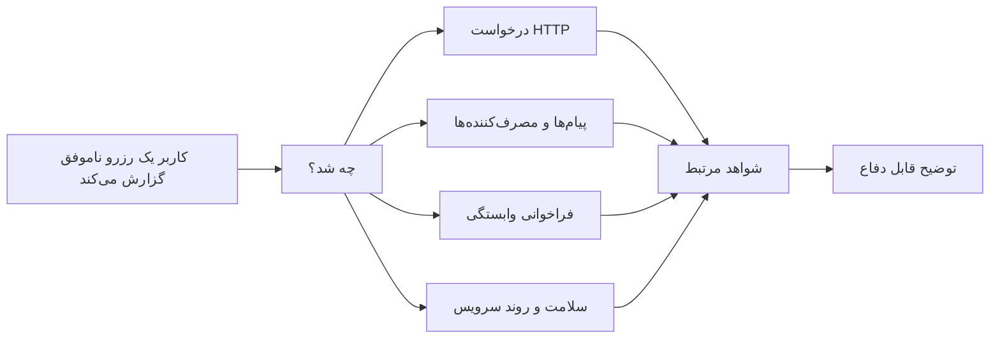
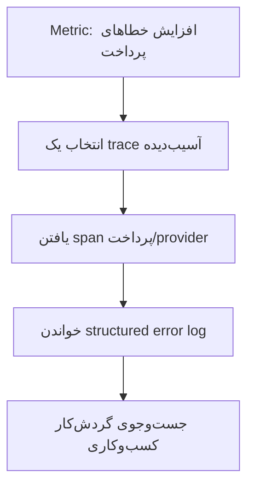
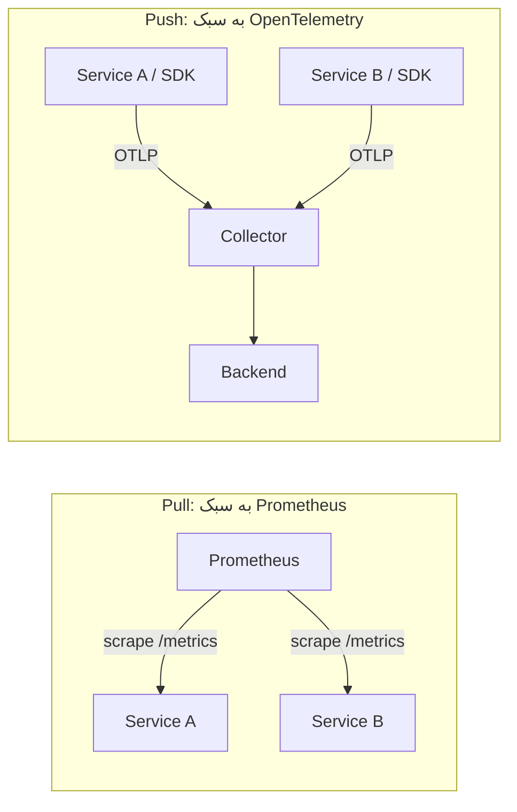
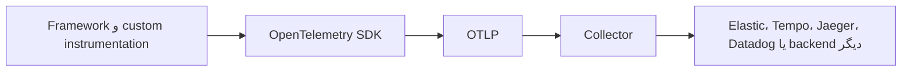
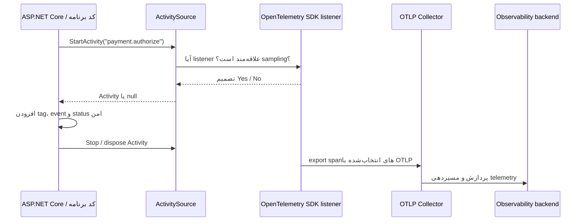

<div dir="rtl">

# مشاهده‌پذیری: فهم یک سامانهٔ توزیع‌شده

[English](README.md)

این راهنما از سامانهٔ رزرو موجود در این مخزن به‌عنوان نمونه استفاده می‌کند، اما مفاهیم آن برای .NET، Java/Spring، Python/Django، سرویس‌های frontend و دیگر برنامه‌های توزیع‌شده کاربرد دارد.

برای جزئیات پیاده‌سازی، چیدمان پروژه و اجرای محلی، [راهنمای فنی](README.technical.fa.md) را ببینید.

## چرا مشاهده‌پذیری مهم است

در یک برنامهٔ ساده، یک درخواست ناموفق معمولاً در یک فرایند و یک جریان لاگ باقی می‌ماند. در یک برنامهٔ توزیع‌شده، همان اقدام می‌تواند زنجیره‌ای از کارهای مستقل شود: یک درخواست HTTP پیام منتشر می‌کند، یک worker بعداً آن را مصرف می‌کند، سرویس دیگری وابستگی بیرونی را فراخوانی می‌کند و نتیجه‌ای به‌صورت غیرهم‌زمان رخ می‌دهد. کاربر فقط یک نتیجه می‌بیند؛ مهندس باید چند قطعهٔ شواهد را درک کند.



مشاهده‌پذیری به این معنی نیست که برای هر رخداد، هر مهندس باید همهٔ سیگنال‌ها را بررسی کند. یعنی سامانه آن‌قدر context نگه دارد که پس از خطا بتوان پرسشی تازه مطرح کرد و به‌جای حدس‌زدن از روی timestampها، مسیر شواهد را تا پاسخ دنبال کرد.

## logs، metrics و traces

این سیگنال‌ها هم‌پوشانی دارند، اما در سطح متفاوتی به بررسی رخداد کمک می‌کنند.

| سیگنال | چه چیزی ثبت می‌کند؟ | پرسش مناسب برای شروع | نمونه در این سامانه |
| --- | --- | --- | --- |
| Log | رویداد، تصمیم یا exception با جزئیات | «کد پرداخت چه تصمیمی گرفت؟» | علت ردشدن توسط provider |
| Metric | اندازه‌گیری تجمیعی از رویدادهای بسیار | «آیا خطاهای پرداخت در حال افزایش‌اند؟» | تعداد خطا یا histogram مدت‌زمان |
| Trace | گراف زمان‌دار یک عملیات | «کدام سرویس یا وابستگی کند بود؟» | مسیر HTTP → RabbitMQ → Payment |

یک metric برای تشخیص تغییر گسترده کارآمد است و عمداً جزئیات هر درخواست را از دست می‌دهد. trace مسیر اجرا و زمان‌بندی یک عملیات را برمی‌گرداند. log نیز context غنی محلی، مانند exception، پاسخ provider یا دلیل کسب‌وکاری را اضافه می‌کند. جایگزین دانستن یکی به‌جای دیگری، نقطهٔ کور ایجاد می‌کند.

### سیگنال‌ها چگونه با هم کار می‌کنند

فرض کنید پس از تغییر provider، خطاهای پرداخت زیاد می‌شوند. metric نشان می‌دهد نرخ خطا تغییر کرده و دامنهٔ اثر چقدر است، اما مسیر دقیق یک رزرو را نشان نمی‌دهد. trace می‌تواند کند یا ناموفق‌بودن span مربوط به provider را آشکار کند، اما شاید متن توضیح provider را نداشته باشد. structured log آن پیام و شناسه‌های لازم برای جست‌وجو را در بر می‌گیرد. بررسی قدرتمند می‌شود چون سیگنال‌ها به یکدیگر راه می‌دهند.



### metricهای pull در برابر push

Prometheus مدل **pull** را رایج کرد: سرور Prometheus targetها را کشف می‌کند و endpoint ‌`/metrics` هر سرویس را به‌صورت دوره‌ای scrape می‌کند. این مدل برای زیرساخت در یک محیط با اتصال مناسب قدرتمند است: collector زمان scrape را کنترل می‌کند، می‌بیند target در دسترس هست یا نه و service discovery بخش اصلی طراحی است.

OpenTelemetry برای metricهای برنامه معمولاً از **push** استفاده می‌کند: SDK اندازه‌گیری‌ها را batch کرده و با OTLP به Collector می‌فرستد؛ Collector سپس آن‌ها را به backend انتخابی می‌فرستد.



برای این مخزن، **push مدل ترجیحی برای telemetry برنامه است**:

- یک مسیر OTLP برای metrics، traces و logs داریم؛ بنابراین تیم برنامه تنها یک مسیر خروج telemetry پیکربندی می‌کند؛
- سرویس‌ها به endpoint قابل دسترس برای scrape یا discovery مخصوص scraper نیاز ندارند؛
- Collector، batch، retry، authentication، filtering و routing به backend را متمرکز می‌کند؛ این موضوع برای containerها، workerهای کوتاه‌عمر و چند محیط کاربردی است؛
- برنامه مستقل از backend باقی می‌ماند: با عوض‌کردن exporter در Collector، کد تولید metric عوض نمی‌شود.

این ترجیح برای برنامهٔ رویدادمحور این مخزن است، نه رد Prometheus. pull همچنان برای metricهای Kubernetes، node و زیرساخت و تیم‌هایی که در Prometheus discovery و PromQL سرمایه‌گذاری کرده‌اند عالی است. مدل ترکیبی متداول است: زیرساخت را با Prometheus scrape کنید و telemetry برنامه را با OTLP push کنید. [Prometheus و OTLP](https://opentelemetry.io/docs/compatibility/prometheus/otlp-metrics-export/)، [OTLP metrics exporter](https://opentelemetry.io/docs/specs/otel/metrics/sdk_exporters/otlp/)

## structured logs و Serilog

یک رکورد لاگ باید چیزی بیش از یک جملهٔ renderشده باشد. می‌تواند زمان، level، category، exception، message template، propertyهای نام‌دار و attributeهای contextual مثل نام سرویس یا correlation ID داشته باشد.

```csharp
// شناسه تنها بخشی از متن است؛ backend باید جمله را parse کند.
logger.LogInformation($"Payment {paymentId} failed");

// شناسه‌ها propertyهای مستقل و قابل جست‌وجو هستند.
logger.LogWarning(
    "Payment {PaymentId} failed for booking {BookingId}: {Reason}",
    paymentId, bookingId, reason);
```

در .NET، `ILogger<T>` یک abstraction است. `ILoggerFactory` رکوردها را به providerهای ثبت‌شده می‌فرستد و ASP.NET Core این pipeline را با `WebApplication.CreateBuilder` و dependency injection پیکربندی می‌کند. این مخزن از Serilog به‌عنوان provider برای رویدادهای ساخت‌یافته، enrichment context، خروجی console، export لاگ از طریق OTLP و یک رکورد تکمیل درخواست برای هر HTTP request استفاده می‌کند. کد کسب‌وکار همچنان به `ILogger<T>` وابسته است، نه API اختصاصی Serilog.

لاگ ساخت‌یافته در سامانهٔ توزیع‌شده حیاتی است، چون یک جملهٔ قابل‌خواندن برای انسان data model پایداری نیست. نام فیلدهایی مانند `BookingId`، `PaymentId`، `Reason`، `ServiceName` و `CorrelationId` دستگیره‌هایی می‌شوند که با آن‌ها می‌توان شواهد را filter، aggregate، alert و مرتبط کرد. نام‌هایی متناسب با دامنه انتخاب کنید، retention و امنیت مقدارها را در نظر بگیرید و دادهٔ حساس یا high-cardinality را بدون سیاست مشخص وارد نکنید.

## OpenTelemetry

OpenTelemetry یک استاندارد و ecosystem متن‌باز و مستقل از فروشنده است. API، SDK، instrumentation library، semantic convention، Collector و OTLP، یعنی پروتکل انتقال telemetry، را تعریف می‌کند. خود آن database، dashboard یا محصول alerting نیست.



این مرز، instrumentation برنامه را از تغییر backend محافظت می‌کند. انتقال به backend دیگر ممکن است همچنان dashboard، query، retention و alert را تغییر دهد، اما مجبور نیست هر span دستی در کد را بازنویسی کند. در .NET، OpenTelemetry بر `System.Diagnostics.Activity`، `ActivitySource` و `Meter` بنا شده است؛ یک `Activity` از نظر مفهومی همان span است.

OpenTelemetry همچنین زبان مشترک تیم‌هاست. سرویس می‌تواند attributeها را با semantic convention ثبت کند، context استاندارد W3C را روی HTTP و messaging منتقل کند و سیگنال‌ها را با OTLP بفرستد. بنابراین سرویس‌های چندزبان راحت‌تر در یک بررسی واحد مشارکت می‌کنند.

### SDK ‏OpenTelemetry در .NET چگونه کار می‌کند

OpenTelemetry در .NET یک دنیای tracing جداگانه جایگزین runtime diagnostics نمی‌کند؛ بر APIهای diagnostics خود runtime ساخته می‌شود.



| نوع .NET | مسئولیت | رابطه با OpenTelemetry |
| --- | --- | --- |
| `Activity` | یک عملیات درون‌فرایندی با زمان شروع/پایان، parent context، ID، tag، event، link و status | از نظر مفهومی یک span |
| `Activity.Current` | عملیات محیطی جاری را در اجرای async حمل می‌کند | فرزندها trace/span context را به ارث می‌برند |
| `ActivitySource` | producer نام‌دار برای ساخت `Activity` | منبع tracing برنامه/کتابخانه که SDK به آن subscribe می‌شود |
| `ActivityListener` | lifecycle فعالیت را می‌بیند و در sampling مشارکت می‌کند | primitive listener مورد استفادهٔ زیرساخت tracing |
| `Meter` | producer نام‌دار instrumentهای metric | همتای metric برای `ActivitySource` |
| Instruments | `Counter`، `UpDownCounter`، `Histogram`، `ObservableGauge` و… | measurement همراه با dimension/tag اختیاری تولید می‌کنند |

نکتهٔ مهم کارایی این است که وقتی listener علاقه‌مندی وجود ندارد، `ActivitySource.StartActivity` می‌تواند `null` برگرداند. بنابراین instrumentation libraryها می‌توانند diagnostics منتشر کنند بدون آن‌که همیشه span ایجاد و export شود. وقتی SDK با `.AddSource("name")` پیکربندی شود، به همان source نام‌دار گوش می‌دهد، sampler و processor را اعمال می‌کند و Activityهای انتخاب‌شده را export می‌کند.

```csharp
// کد برنامه یا کتابخانه: انتشار یک عملیات معنادار.
private static readonly ActivitySource Source = new("Booking.Payment");

using var activity = Source.StartActivity("payment.authorize");
activity?.SetTag("payment.provider", "example-provider");
activity?.SetStatus(ActivityStatusCode.Error, "Provider rejected payment");
```

این کار با ساخت دستی `TraceId` فرق دارد. runtime رابطهٔ parent/child را از `Activity.Current` می‌سازد؛ instrumentation فریم‌ورک نیز در مرزهای پشتیبانی‌شدهٔ HTTP و messaging، header استاندارد W3C یعنی `traceparent` را می‌خواند یا تزریق می‌کند. در این مخزن، ASP.NET Core و `HttpClient` spanهای فریم‌ورکی می‌سازند و MassTransit فعالیت‌های خود را با source مخصوص خود منتشر می‌کند. [Service Defaults](Aspire/ELKStack.ServiceDefaults/Extensions.cs) به source سرویس و `MassTransit` subscribe می‌شود:

```csharp
.WithTracing(tracing => tracing
    .AddSource(serviceName)
    .AddSource("MassTransit")
    .AddAspNetCoreInstrumentation()
    .AddHttpClientInstrumentation());
```

metricها همان ایدهٔ producer/listener را برای پرسش‌های تجمیعی دنبال می‌کنند. یک `Meter` instrumentهای نام‌دار دارد. counter رخداد را ثبت می‌کند، up/down counter مقداری را نشان می‌دهد که بالا و پایین می‌رود و histogram توزیعی مثل مدت‌زمان درخواست یا provider را ثبت می‌کند. dimensionها filterهای خوبی هستند، اما مقدارهای نامحدود مانند booking ID نباید dimension metric شوند؛ چنین کاری high cardinality و هزینهٔ metric را بالا می‌برد.

```csharp
private static readonly Meter Meter = new("Booking.Payment");
private static readonly Counter<long> Failures =
    Meter.CreateCounter<long>("payment.failures");
private static readonly Histogram<double> Duration =
    Meter.CreateHistogram<double>("payment.provider.duration", unit: "ms");

Failures.Add(1, new KeyValuePair<string, object?>("payment.outcome", "failed"));
Duration.Record(elapsed.TotalMilliseconds);
```

SDK این measurementها را جمع‌آوری و مطابق pipeline metric تجمیع می‌کند و سپس export می‌کند. به همین دلیل metric می‌تواند ارزان به پرسش «آیا نرخ خطا بالا می‌رود؟» پاسخ دهد، در حالی که trace یا log هنوز برای توضیح یک خطای مشخص لازم است. مستندات Microsoft، `ActivitySource` را API ساخت Activity و ثبت listener و `Meter` را نوع سازنده و نگهدارندهٔ instrumentها معرفی می‌کند. [ActivitySource](https://learn.microsoft.com/en-us/dotnet/api/system.diagnostics.activitysource)، [Meter](https://learn.microsoft.com/en-us/dotnet/api/system.diagnostics.metrics.meter)

## instrumentation خودکار و کدنویسی‌شده

instrumentation خودکار مرزهای رایج فریم‌ورک را با تغییر کم یا بدون تغییر کد برنامه مشاهده می‌کند. بسته به runtime، این کار می‌تواند با Java agent، monkey patch در Python، startup hook/profiling در .NET یا eBPF انجام شود. راهی عالی برای پوشش سریع HTTP ورودی، HTTP خروجی، database، messaging و signalهای runtime است.

instrumentation درون کد با قصد مشخص telemetry تولید می‌کند. با آن می‌توان عملیات معنادار کسب‌وکار را نام‌گذاری کرد، attributeهای امن کسب‌وکاری افزود، زمان provider پرداخت را ثبت کرد یا outcomeهای دامنه را شمرد.

| instrumentation خودکار را ترجیح دهید وقتی… | instrumentation کدنویسی‌شده را ترجیح دهید وقتی… |
| --- | --- |
| یک مرز framework/library کافی است | پرسش دربارهٔ intent کسب‌وکاری است |
| baseline سریع یا پوشش legacy می‌خواهید | span یا metric مخصوص دامنه لازم دارید |
| telemetry یکنواخت کتابخانه می‌خواهید | باید attribute و cardinality را کنترل کنید |

بهترین طراحی هر دو را ترکیب می‌کند. [OpenTelemetry zero-code instrumentation](https://opentelemetry.io/docs/zero-code/) روش‌های پشتیبانی‌شده در زبان‌های مختلف را مستند می‌کند.

## در اکوسیستم‌های مختلف

syntaxها متفاوت‌اند، اما مدل یکسان است.

| اکوسیستم | instrumentation خودکار رایج | API قابل برنامه‌نویسی |
| --- | --- | --- |
| ASP.NET Core | ASP.NET Core، HttpClient، runtime و کتابخانه‌های پشتیبانی‌شده | `ActivitySource`، `Meter` و OTel .NET SDK |
| Java / Spring | Java agent برای servlet، Spring، JDBC و کتابخانه‌ها | OTel Java API/SDK |
| Python / Django | `opentelemetry-instrument` برای Django و کتابخانه‌ها | OTel Python API/SDK |

همه می‌توانند trace context را حفظ کنند، resource attributeهایی مانند نام سرویس و environment را اضافه کنند، semantic conventionها را دنبال کنند و با OTLP export کنند.

## اجرای فنی و گردش‌کار کسب‌وکاری

tracing یک گراف اجرای فنی است. گردش‌کارهای کسب‌وکاری اغلب به نوع دوم context هم نیاز دارند. این مخزن هر دو را نگه می‌دارد:

```text
TraceId       مسیر فنی و زمان‌بندی یک اجرای محدود
CorrelationId عضویت در یک گردش‌کار کاربر/کسب‌وکار
EventId       هویت یک پیام یا رویداد
CausationId   رویداد پیشینی که علت رویداد فعلی است
```

مثلاً retry پرداخت می‌تواند trace جدیدی باشد، اما همچنان به همان گردش‌کار رزرو تعلق داشته باشد. پیام زمان‌بندی‌شده یا تأیید انسانی ممکن است ساعت‌ها پس از پایان درخواست HTTP اولیه رخ دهد. correlation کسب‌وکاری این داستان طولانی‌تر را قابل جست‌وجو می‌کند، بدون آن‌که آن را یک trace پیوسته جلوه دهد.

## چشم‌انداز ابزارها

هیچ فهرستی توصیهٔ قطعی برای همه نیست. این ابزارهای شناخته‌شده شکل معمول ecosystem را نشان می‌دهند:

| سیگنال | ابزارهای متن‌بازمحور | پلتفرم‌های یکپارچه/تجاری |
| --- | --- | --- |
| Metrics | Prometheus، Grafana Mimir، VictoriaMetrics | Elastic، Datadog، New Relic |
| Logs | Elastic، Grafana Loki، OpenSearch | Splunk، Datadog، New Relic |
| Traces | Jaeger، Grafana Tempo، Zipkin | Elastic APM، Honeycomb، Datadog، New Relic |

[Prometheus](https://prometheus.io/docs/introduction/overview/) یک سیستم metrics محبوب است. [Tempo](https://grafana.com/docs/tempo/latest/) backend tracing است که برای پیوند trace با logs و metrics طراحی شده. [Jaeger](https://www.jaegertracing.io/docs/) پلتفرم distributed tracing است.

## چرا Elastic Observability

Elastic تنها انتخاب معتبر نیست. برای این مخزن، به دلایل عملی زیر مناسب است:

1. **یک سطح بررسی:** structured logها، traceها، metricها و شناسه‌های workflow را می‌توان در یک محصول بررسی کرد.
2. **جست‌وجو متناسب با مسئله است:** `CorrelationId`، `EventId`، `CausationId`، booking ID و نوع پیام دستگیره‌های طبیعی جست‌وجوی رخدادند.
3. **OpenTelemetry قرارداد برنامه می‌ماند:** Elastic برای logs، metrics و traces، OTLP را می‌پذیرد؛ کد به API instrumentation اختصاصی Elastic نوشته نشده است.
4. **Elastic APM حرکت در traceها را آسان‌تر می‌کند:** viewهای service و transaction برای یک دمو رویدادمحور اصطکاک راه‌اندازی را کم می‌کنند.
5. **Collector خنثی باقی می‌ماند:** batching، filtering، sampling، enrichment و routing می‌تواند بیرون از کد برنامه تکامل پیدا کند.

trade-off هم وجود دارد: اجرای Elastic هزینه و ملاحظات عملیاتی/licensing دارد و dashboard و queryها وابسته به backend هستند. ارزش اینجا کوتاه‌کردن مسیر «چیزی مشکل دارد» تا «این عملیات دلیل را توضیح می‌دهد» است، در حالی که instrumentation باز باقی می‌ماند. Elastic دریافت native [OTLP](https://www.elastic.co/docs/solutions/observability/apm/opentelemetry-intake-api) را مستند کرده است.

## خواندن گردش‌کار این مخزن

شناسه‌های کسب‌وکاری، tracing فنی را تکمیل می‌کنند:

```text
TraceId       گراف اجرای فنی و زمان‌بندی
CorrelationId عضویت در یک گردش‌کار کسب‌وکاری
EventId       هویت یک پیام/رویداد
CausationId   پیام پیشینی که باعث پیام بعدی شده است
```

این تفکیک برای retry، delayed message، کار زمان‌بندی‌شده و گردش‌کارهای human-in-the-loop مهم است؛ یک عملیات کسب‌وکاری می‌تواند بیش از یک trace عمر کند.

## بررسی نمونه

راهنمای فنی اجرای سامانه و ارسال درخواست `PaymentFailure` را توضیح می‌دهد. پس از اجرا، این ترتیب را دنبال کنید:

1. پرداخت ناموفق را با یک فیلد ساخت‌یافته در logها پیدا کنید.
2. trace آن را باز کنید و مسیر سرویس/پیام را بررسی کنید.
3. با `CorrelationId` کل گردش‌کار رزرو را جست‌وجو کنید.
4. با `EventId` و `CausationId` بفهمید کدام پیام باعث پیام بعدی شده است.

قول اصلی این مخزن همین است: مهندس باید بتواند از «چیزی مشکل دارد» به «این عملیات توضیح می‌دهد چرا» برسد.

</div>
