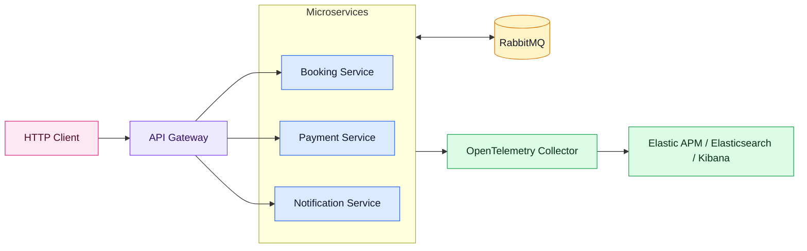
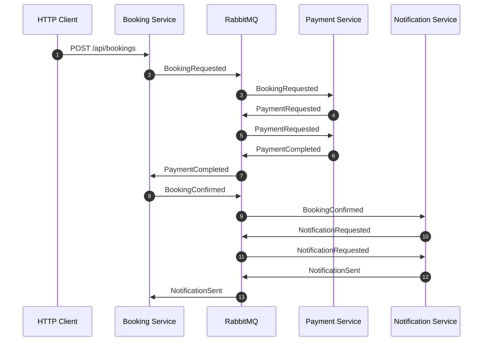
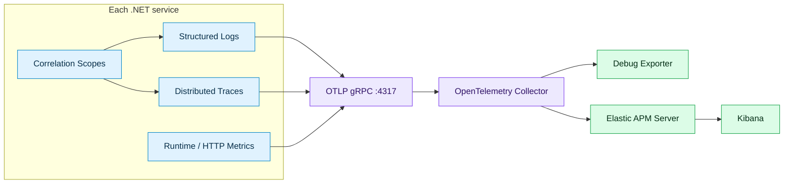

```mermaid
flowchart LR
    A["A: BookingRequested<br/>root"]
    B["B: PaymentRequested<br/>caused by A"]
    C["C: PaymentCompleted<br/>caused by B"]
    D["D: BookingConfirmed<br/>caused by C"]
    E["E: NotificationRequested<br/>caused by D"]
    F["F: NotificationSent<br/>caused by E"]

    A --> B --> C --> D --> E --> F

    classDef root fill:#fee2e2,stroke:#dc2626,color:#450a0a
    classDef payment fill:#fef3c7,stroke:#d97706,color:#422006
    classDef booking fill:#dbeafe,stroke:#2563eb,color:#172554
    classDef notify fill:#dcfce7,stroke:#16a34a,color:#052e16

    class A root
    class B,C payment
    class D booking
    class E,F notify
```

<h1 dir="rtl" align="right">ELKStack</h1>

<p dir="rtl" align="right">
  <a href="README.md"><strong>English</strong></a>
</p>

<p dir="rtl" align="right">
یک نمونه میکروسرویسی با <span dir="ltr">.NET 8</span> برای نمایش یک جریان واقعی مبتنی بر رویداد روی استک مشاهده‌پذیری <span dir="ltr">ELK + APM Server + OpenTelemetry Collector</span>.
</p>

<p dir="rtl" align="right">
این پروژه شامل سه سرویس مبتنی بر کنترلر است که با <span dir="ltr">RabbitMQ</span> و <span dir="ltr">MassTransit 8</span> با هم ارتباط برقرار می‌کنند. هر سرویس می‌تواند درخواست <span dir="ltr">HTTP</span> دریافت کند، رویداد منتشر کند، رویداد مصرف کند، لاگ ساخت‌یافته تولید کند و داده‌های مشاهده‌پذیری را از طریق <span dir="ltr">OpenTelemetry</span> ارسال کند.
</p>

<h2 dir="rtl" align="right">پروژه‌های Solution</h2>

<table dir="rtl" align="right">
  <thead>
    <tr>
      <th align="right">پروژه</th>
      <th align="right">مسئولیت</th>
    </tr>
  </thead>
  <tbody>
    <tr>
      <td align="left"><a href="src/ELKStack.Contracts/IntegrationEvents.cs">ELKStack.Contracts</a></td>
      <td align="right">قراردادهای مشترک رویدادها و متادیتای مربوط به آن‌ها.</td>
    </tr>
    <tr>
      <td align="left"><a href="src/ELKStack.Observability/ObservabilityExtensions.cs">ELKStack.Observability</a></td>
      <td align="right">زیرساخت مشترک برای لاگ ساخت‌یافته، همبستگی درخواست‌ها و رویدادها، فیلترهای MassTransit و ارسال داده‌ها با OpenTelemetry.</td>
    </tr>
    <tr>
      <td align="left"><a href="src/ELKStack.BookingService/Program.cs">ELKStack.BookingService</a></td>
      <td align="right">نقطه ورود HTTP برای ثبت رزرو، نگهداری وضعیت رزرو و مصرف رویدادهای مربوط به چرخه عمر رزرو.</td>
    </tr>
    <tr>
      <td align="left"><a href="src/ELKStack.PaymentService/Program.cs">ELKStack.PaymentService</a></td>
      <td align="right">جریان درخواست پرداخت و تکمیل پرداخت.</td>
    </tr>
    <tr>
      <td align="left"><a href="src/ELKStack.NotificationService/Program.cs">ELKStack.NotificationService</a></td>
      <td align="right">جریان درخواست اعلان و ثبت ارسال اعلان.</td>
    </tr>
  </tbody>
</table>

<h2 dir="rtl" align="right">معماری</h2>



<p dir="rtl" align="right">
در این نمودار، <span dir="ltr">API Gateway</span> فقط به عنوان یک جزء اختیاری در لبه سیستم نشان داده شده است. این بخش در کد نمونه پیاده‌سازی نشده و هر سه سرویس را می‌توان مستقیم صدا زد.
</p>

<p dir="rtl" align="right">
سرویس‌ها عمداً کوچک و درون‌حافظه‌ای هستند. هدف این است که تمرکز ارائه روی رهگیری توزیع‌شده، رابطه علت و معلولی بین رویدادها، لاگ ساخت‌یافته و ارسال داده‌های مشاهده‌پذیری بماند؛ نه روی دیتابیس یا پیچیدگی‌های ذخیره‌سازی.
</p>

<h2 dir="rtl" align="right">نقطه ورود درخواست</h2>

<p dir="rtl" align="right">
دموی معمول با این درخواست شروع می‌شود:
</p>

```http
POST http://localhost:5101/api/bookings
Content-Type: application/json
X-Correlation-ID: 4b05c640-2a8a-42c9-a732-75a608f7dc09

{
  "passengerName": "Sara Ahmadi",
  "customerEmail": "sara@example.com",
  "destination": "Berlin",
  "amount": 1490,
  "currency": "EUR"
}
```

<p dir="rtl" align="right">
درخواست به <a href="src/ELKStack.BookingService/Controllers/BookingsController.cs"><span dir="ltr">BookingsController.Create</span></a> می‌رسد. این متد یک رویداد از نوع <span dir="ltr">BookingRequested</span> می‌سازد و آن را منتشر می‌کند:
</p>

```csharp
var metadata = correlationContext.CreateMetadata();
var message = new BookingRequested(
    Guid.NewGuid(),
    request.PassengerName,
    request.CustomerEmail,
    request.Destination,
    request.Amount,
    request.Currency.ToUpperInvariant(),
    DateTimeOffset.UtcNow,
    metadata.EventId,
    metadata.CorrelationId,
    metadata.CausationId);

await publishEndpoint.Publish(message, cancellationToken);
```

<p dir="rtl" align="right">
از این لحظه، یک درخواست HTTP به ریشه یک زنجیره رویداد تبدیل می‌شود.
</p>

<h2 dir="rtl" align="right">Correlation و Causation</h2>

<p dir="rtl" align="right">
سیستم دو نوع رابطه متفاوت را دنبال می‌کند:
</p>

<table dir="rtl" align="right">
  <thead>
    <tr>
      <th align="right">فیلد</th>
      <th align="right">معنی</th>
      <th align="right">مثال</th>
    </tr>
  </thead>
  <tbody>
    <tr>
      <td align="left"><code>CorrelationId</code></td>
      <td align="right">شناسه کل جریان کاری. همه رویدادهایی که از یک اقدام کاربر ایجاد شده‌اند این مقدار را مشترک دارند.</td>
      <td align="right">همه اتفاق‌هایی که به خاطر درخواست رزرو رخ داده‌اند.</td>
    </tr>
    <tr>
      <td align="left"><code>CausationId</code></td>
      <td align="right">شناسه رویداد والد مستقیم. این فیلد درخت رویداد را می‌سازد.</td>
      <td align="right">رویداد <code>PaymentCompleted</code> توسط <code>PaymentRequested</code> ایجاد شده است.</td>
    </tr>
    <tr>
      <td align="left"><code>EventId</code></td>
      <td align="right">شناسه یکتای یک نمونه رویداد.</td>
      <td align="right">رویداد A از نوع <code>BookingRequested</code>.</td>
    </tr>
  </tbody>
</table>

<p dir="rtl" align="right">
همه رویدادها <a href="src/ELKStack.Contracts/IntegrationEvents.cs"><span dir="ltr">IIntegrationEvent</span></a> را پیاده‌سازی می‌کنند:
</p>

```csharp
public interface IIntegrationEvent
{
    Guid EventId { get; }
    DateTimeOffset OccurredAt { get; }
    Guid CorrelationId { get; }
    Guid? CausationId { get; }
}
```

<p dir="rtl" align="right">
برای درخواست‌های HTTP، <a href="src/ELKStack.Observability/Correlation/CorrelationMiddleware.cs"><span dir="ltr">CorrelationMiddleware</span></a> این کارها را انجام می‌دهد:
</p>

<ul dir="rtl" align="right">
  <li>اگر client مقدار <code>X-Correlation-ID</code> فرستاده باشد، همان را می‌خواند.</li>
  <li>در غیر این صورت از <code>X-Request-ID</code> استفاده می‌کند.</li>
  <li>اگر هیچ‌کدام وجود نداشته باشد، یک شناسه جدید می‌سازد.</li>
  <li>عملیات فعلی را در <code>ICorrelationContextAccessor</code> نگه می‌دارد.</li>
  <li>فیلدهای همبستگی را به log scope و tagهای OpenTelemetry اضافه می‌کند.</li>
  <li>مقدارهای همبستگی را در response header برمی‌گرداند.</li>
</ul>

<p dir="rtl" align="right">
برای رویدادها، <a href="src/ELKStack.Observability/Correlation/CorrelationConsumeFilter.cs"><span dir="ltr">CorrelationConsumeFilter</span></a> و <a href="src/ELKStack.Observability/Correlation/CorrelationPublishFilter.cs"><span dir="ltr">CorrelationPublishFilter</span></a> همین مدل را به MassTransit وصل می‌کنند.
</p>

<p dir="rtl" align="right">
وقتی یک consumer رویدادی را دریافت می‌کند، عملیات فعلی به یک عملیات فرزند تبدیل می‌شود:
</p>

```csharp
public static CorrelationContext CreateForConsumedEvent(IIntegrationEvent message) =>
    new(Guid.NewGuid(), message.CorrelationId, message.EventId);
```

<p dir="rtl" align="right">
در نتیجه هر رویداد جدیدی که از داخل consumer منتشر شود این مقدارها را می‌گیرد:
</p>

<ul dir="rtl" align="right">
  <li>همان <code>CorrelationId</code></li>
  <li>یک <code>EventId</code> جدید</li>
  <li><code>CausationId</code> برابر با <code>EventId</code> رویدادی که مصرف شده است</li>
</ul>

<h2 dir="rtl" align="right">زنجیره رویدادها</h2>



<br/>

<h3 dir="rtl" align="right">درخت رویداد</h3>



<p dir="rtl" align="right">
همه خانه‌های این درخت یک <code>CorrelationId</code> مشترک دارند. رابطه والد و فرزند با <code>CausationId</code> ساخته می‌شود.
</p>

<br/>

<h2 dir="rtl" align="right">جریان Observability</h2>



<p dir="rtl" align="right">
تنظیمات مشترک در <a href="src/ELKStack.Observability/ObservabilityExtensions.cs"><span dir="ltr">ObservabilityExtensions</span></a> قرار دارد:
</p>

<ul dir="rtl" align="right">
  <li><code>AddElkStackObservability()</code>، Serilog، OpenTelemetry، سرویس‌های همبستگی، health check و HTTP logging را تنظیم می‌کند.</li>
  <li><code>UseElkStackObservability()</code>، correlation middleware، HTTP logging، Serilog request logging و health endpointها را به pipeline اضافه می‌کند.</li>
  <li><code>UseCorrelationFilters()</code>، فیلترهای consume/publish مربوط به MassTransit را برای انتشار متادیتای رویدادها اضافه می‌کند.</li>
</ul>

<h3 dir="rtl" align="right">لاگ ساخت‌یافته</h3>

<p dir="rtl" align="right">
سرویس‌ها از Serilog برای لاگ ساخت‌یافته استفاده می‌کنند و رکوردها را با فیلدهای سرویس، محیط اجرا، درخواست، correlation، causation و operation غنی می‌کنند. کد مرتبط: <a href="src/ELKStack.Observability/ObservabilityExtensions.cs"><span dir="ltr">AddStructuredLogging</span></a>.
</p>

<h3 dir="rtl" align="right">OpenTelemetry</h3>

<p dir="rtl" align="right">
سرویس‌ها این داده‌ها را ارسال می‌کنند:
</p>

<ul dir="rtl" align="right">
  <li>traceهای ASP.NET Core</li>
  <li>traceهای HTTP client</li>
  <li>traceهای MassTransit از طریق activity source با نام <code>MassTransit</code></li>
  <li>runtime metrics</li>
  <li>HTTP metrics</li>
  <li>لاگ‌های ساخت‌یافته از طریق OpenTelemetry logging و Serilog OTLP sink</li>
</ul>

<p dir="rtl" align="right">
کد مرتبط: <a href="src/ELKStack.Observability/ObservabilityExtensions.cs"><span dir="ltr">AddOpenTelemetryExport</span></a>.
</p>

<h2 dir="rtl" align="right">اجزای Runtime</h2>

<p dir="rtl" align="right">
فایل <a href="docker-compose.yml"><span dir="ltr">docker-compose.yml</span></a> این اجزا را اجرا می‌کند:
</p>

<table dir="rtl" align="right">
  <thead>
    <tr>
      <th align="right">جزء</th>
      <th align="right">پورت</th>
      <th align="right">هدف</th>
    </tr>
  </thead>
  <tbody>
    <tr>
      <td align="left">RabbitMQ</td>
      <td align="left"><code>5672</code></td>
      <td align="right">مسیر انتقال پیام برای MassTransit.</td>
    </tr>
    <tr>
      <td align="left">RabbitMQ Management</td>
      <td align="left"><code>15672</code></td>
      <td align="right">رابط کاربری مرورگری برای exchangeها، queueها و messageها.</td>
    </tr>
    <tr>
      <td align="left">OpenTelemetry Collector gRPC</td>
      <td align="left"><code>4317</code></td>
      <td align="right">داده‌های telemetry را از سرویس‌ها دریافت می‌کند.</td>
    </tr>
    <tr>
      <td align="left">OpenTelemetry Collector HTTP</td>
      <td align="left"><code>4318</code></td>
      <td align="right">receiver اختیاری برای OTLP HTTP.</td>
    </tr>
  </tbody>
</table>

<p dir="rtl" align="right">
تنظیمات collector در <a href="otel-collector-config.yml"><span dir="ltr">otel-collector-config.yml</span></a> قرار دارد. این collector داده‌های OTLP را دریافت می‌کند، آن‌ها را batch می‌کند، در debug exporter می‌نویسد و به Elastic APM ارسال می‌کند.
</p>

```yaml
exporters:
  debug:
    verbosity: basic
  otlp/elastic:
    endpoint: ${ELASTIC_APM_ENDPOINT}
    tls:
      insecure: true
```

<h2 dir="rtl" align="right">اجرای محلی</h2>

<p dir="rtl" align="right">
ایجاد یک رزرو:
</p>

```powershell
$correlationId = [guid]::NewGuid()

Invoke-RestMethod http://localhost:5101/api/bookings `
  -Method Post `
  -ContentType 'application/json' `
  -Headers @{ 'X-Correlation-ID' = $correlationId } `
  -Body '{"passengerName":"Sara Ahmadi","customerEmail":"sara@example.com","destination":"Berlin","amount":1490,"currency":"EUR"}'
```

<h2 dir="rtl" align="right">ELK APM در برابر Grafana Stack</h2>

<p dir="rtl" align="right">
Grafana، Loki، Tempo، Prometheus و Jaeger ابزارهای قدرتمندی هستند. استدلال این نمونه این نیست که آن‌ها ضعیف‌اند؛ استدلال این است که مسیر Elastic + APM Server + OpenTelemetry Collector برای چنین سیستم توزیع‌شده و مبتنی بر رویداد، مدل عملیاتی یکپارچه‌تری به تیم می‌دهد.
</p>

<table dir="rtl" align="right">
  <thead>
    <tr>
      <th align="right">نقطه تصمیم</th>
      <th align="right">Elastic + APM + OTel Collector</th>
      <th align="right">Grafana/Loki/Tempo/Prometheus</th>
    </tr>
  </thead>
  <tbody>
    <tr>
      <td align="right">بررسی چند سیگنال در یک مسیر</td>
      <td align="right">لاگ، متریک، تریس، APM، زیرساخت و سیگنال‌های مرتبط در یک تجربه Elastic Observability بررسی می‌شوند.</td>
      <td align="right">استک معمولاً بر اساس نوع سیگنال جدا می‌شود: Loki برای لاگ، Tempo یا Jaeger برای تریس، Prometheus یا Mimir برای متریک و Grafana برای نمایش.</td>
    </tr>
    <tr>
      <td align="right">سازگاری با OpenTelemetry</td>
      <td align="right">Elastic از دریافت OTLP از مسیرهای OpenTelemetry Collector و APM پشتیبانی می‌کند، بنابراین کد می‌تواند OTel-first بماند.</td>
      <td align="right">این استک هم از OTel پشتیبانی می‌کند، اما تیم معمولاً چند backend تخصصی و چند datasource integration را نگهداری می‌کند.</td>
    </tr>
    <tr>
      <td align="right">Debug کردن این workflow</td>
      <td align="right"><code>CorrelationId</code>، <code>CausationId</code> و <code>EventId</code> در همان platform مربوط به trace و log قابل جستجو و ارتباط‌دهی هستند.</td>
      <td align="right">Correlation معمولاً به datasource linking، قراردادهای label و نظم query بین چند سیستم جدا وابسته می‌شود.</td>
    </tr>
    <tr>
      <td align="right">سطح عملیاتی</td>
      <td align="right">یک backend اصلی برای search/analytics و یک مسیر UI برای داستان demo.</td>
      <td align="right">اجزای عملیاتی بیشتر: backend لاگ، backend تریس، backend متریک، لایه visualization و meta-monitoring برای خود آن سیستم‌ها.</td>
    </tr>
    <tr>
      <td align="right">جستجوی full-text روی لاگ</td>
      <td align="right">Elasticsearch حول indexed search ساخته شده است؛ بنابراین جستجو روی فیلدهای ساخت‌یافته و متن messageها طبیعی است.</td>
      <td align="right">Grafana یک UI است و Loki رویکرد label-first دارد. مستندات رسمی Loki می‌گوید timestamp و labelها index می‌شوند، نه کل متن log line. متن لاگ بعد از انتخاب stream با LogQL فیلتر می‌شود، اما full-text indexing شبیه Elasticsearch نیست.</td>
    </tr>
  </tbody>
</table>

<p dir="rtl" align="right">
مهم‌ترین نکته برای قانع کردن تیم، workflow مربوط به incident است:
</p>

```text
کاربر گزارش می‌دهد "booking confirmation کند است"
-> CorrelationId را در Elastic جستجو می‌کنیم
-> درخواست HTTP، لاگ‌ها، event IDها و traceها را کنار هم می‌بینیم
-> با CausationId از BookingRequested تا NotificationSent جلو می‌رویم
-> سرویس کند یا event خراب را بدون عوض کردن mental model پیدا می‌کنیم
```

<p dir="rtl" align="right">
به همین دلیل این نمونه روی metadata مربوط به correlation و causation تأکید دارد. انتخاب تکنولوژی فقط درباره جمع‌آوری telemetry نیست؛ درباره کم کردن فاصله بین «یک چیزی خراب است» و «این event در این سرویس علت آن بوده» است.
</p>

<h3 dir="rtl" align="right">منابع</h3>

<ul dir="rtl" align="right">
  <li><a href="https://www.elastic.co/docs/solutions/observability">Elastic Observability overview</a> توضیح می‌دهد که Elastic یک platform یکپارچه برای logs، metrics، traces، APM، infrastructure و operational data مرتبط است.</li>
  <li><a href="https://www.elastic.co/docs/solutions/observability/apm/opentelemetry">Elastic OpenTelemetry docs</a> مسیرهای native برای OTLP/OpenTelemetry از طریق Collector، APM Server و endpointهای managed Elastic را مستند می‌کند.</li>
  <li><a href="https://grafana.com/about/grafana-stack/">Grafana Stack overview</a> اکوسیستم Grafana را به صورت چند محصول جدا برای logs، traces، metrics و profiles معرفی می‌کند.</li>
  <li><a href="https://grafana.com/docs/learning-hub/intro-to-data-sources/00-overview/03-telemetry-types/">Grafana telemetry type guide</a> به صورت مشخص Prometheus را برای metrics و Loki را برای logs معرفی می‌کند.</li>
  <li><a href="https://grafana.com/docs/loki/latest/logql/">Loki query docs</a> می‌گوید Loki timestamp و labelها را index می‌کند، نه کل متن log line را.</li>
  <li><a href="https://grafana.com/docs/loki/latest/operations/meta-monitoring/">Loki meta-monitoring docs</a> نگرانی production مربوط به monitoring خود logging stack را نشان می‌دهد، از جمله metrics cardinality و monitoring جداگانه.</li>
  <li><a href="https://grafana.com/docs/tempo/latest/getting-started/metrics-from-traces/">Tempo metrics-from-traces docs</a> نشان می‌دهد metricهای ساخته‌شده از trace به قابلیت‌هایی مثل metrics-generator یا TraceQL metrics نیاز دارند و ممکن است به storage سازگار با Prometheus نوشته شوند.</li>
</ul>
